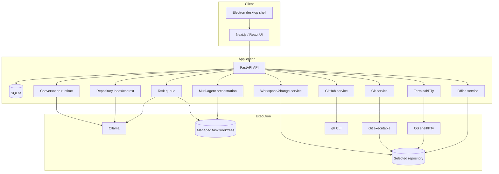
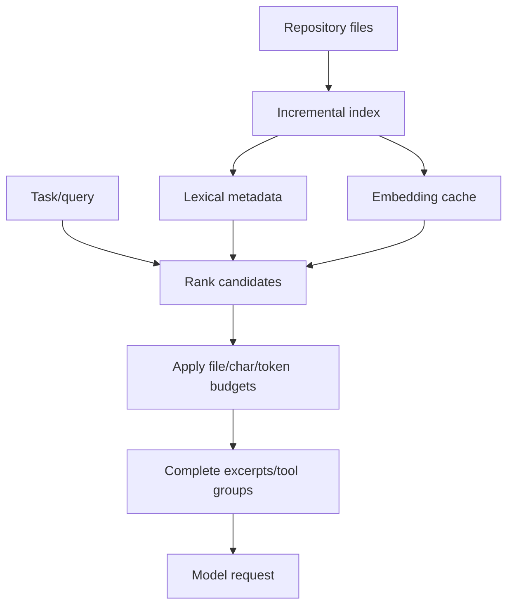
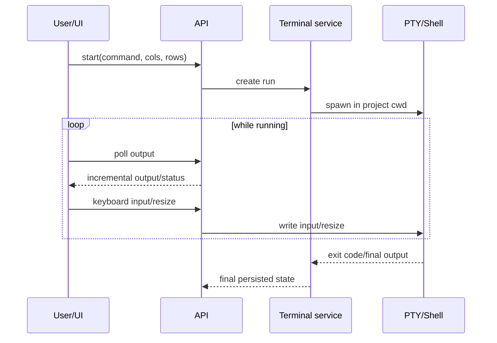
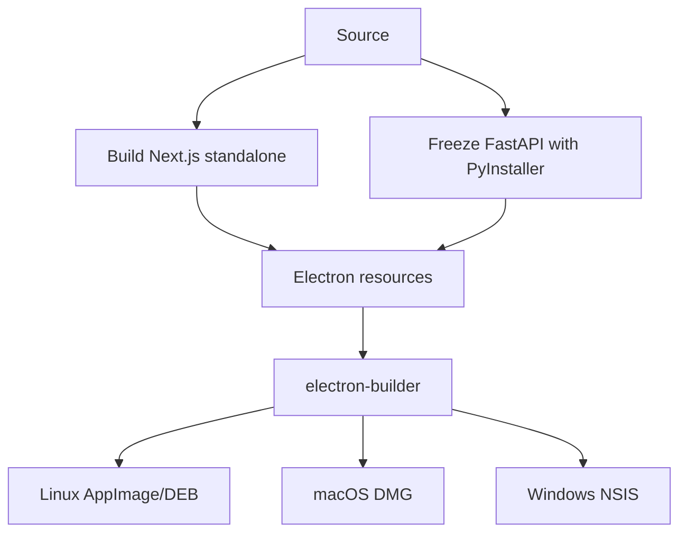

# Olladex Architecture and Developer Reference

**Scope:** Olladex v0.8.1 `main`  
**Audience:** maintainers, reviewers and developers extending Olladex

---

## 1. System overview

Olladex is a local-first, repository-centred development system with four primary runtime layers:

1. browser/Electron UI;
2. FastAPI application/API;
3. local services and SQLite persistence;
4. external/local execution engines: Ollama, Git, shell/PTy and optional GitHub CLI.



---

## 2. Frontend architecture

Primary stack:

```text
Next.js 16
React 19
TypeScript
```

Major UI components include:

```text
frontend/app/page.tsx
frontend/components/Conversation.tsx
frontend/components/FileTree.tsx
frontend/components/GitControls.tsx
frontend/components/GitHubPanel.tsx
frontend/components/TerminalPanel.tsx
frontend/components/DiagramStudio.tsx
frontend/components/OfficePanel.tsx
frontend/components/ProjectPanel.tsx
frontend/components/BackgroundTasksPanel.tsx
frontend/components/TaskOrchestrationPanel.tsx
frontend/components/DesktopUpdateBadge.tsx
```

### State ownership

`frontend/app/page.tsx` owns high-level selected project/session/file/tab state and refresh coordination. Feature components own local form and panel state and communicate with the backend through `frontend/lib/api`.

### Main inspector tabs

```text
files
changes
terminal
diagrams
office
tasks
project
```

Selected file extension can cause automatic inspector routing for diagrams/Office files.

---

## 3. Backend architecture

The backend is a FastAPI application assembled from route modules and service modules.

Important route areas include:

```text
backend/app/api.py
backend/app/main.py
backend/app/chat_routes.py
backend/app/conversation_routes.py
backend/app/github_review_routes.py
backend/app/integration_routes.py
backend/app/orchestration_routes.py
```

Important services include:

```text
backend/app/services/changes.py
backend/app/services/context_engine.py
backend/app/services/conversation_runtime.py
backend/app/services/git.py
backend/app/services/github.py
backend/app/services/integration.py
backend/app/services/office.py
backend/app/services/ollama.py
backend/app/services/orchestration.py
backend/app/services/processes.py
backend/app/services/repository_index.py
backend/app/services/runtime_settings.py
backend/app/services/session_summary.py
backend/app/services/symbols.py
backend/app/services/task_queue.py
backend/app/services/terminal.py
backend/app/services/terminal_jobs.py
backend/app/services/windows_pty.py
backend/app/services/workspace.py
```

### Service design rule

Keep domain logic in services and route handlers thin. New features should not accumulate in the central application assembly file simply because it is convenient.

---

## 4. Configuration architecture

`backend/app/config.py` uses `pydantic-settings` with:

```text
env_prefix = OLLADEX_
env_file = .env
```

Core backend settings include:

```text
data_root
ollama_url
ollama_model
ollama_embedding_model
cors_origins
command_timeout_seconds
max_file_bytes
context_candidate_files
task_workers
api_token
context_tokens
```

Database path is derived from data root:

```text
<data_root>/olladex.sqlite3
```

---

## 5. Authentication and browser trust boundary

The backend requires a bearer API token.

Source launcher behaviour:

- generate token when absent;
- print token to terminal;
- browser uses the token for API calls.

Desktop behaviour:

- desktop shell generates/handles an ephemeral token;
- preload bridge supplies the token without exposing Node integration broadly to the page.

CORS adds an origin restriction but is not authentication.

### Rule

Never weaken/remove bearer authentication to make LAN access easier. Fix routing/origin configuration instead.

---

## 6. Workspace trust boundary

All agent file paths should resolve against the selected repository/task worktree.

Required invariants:

- `..`/absolute path escapes cannot reach arbitrary host files;
- task execution resolves to the task worktree rather than the main checkout;
- normal UI project reads continue to use the main selected repository;
- symlink behaviour is conservative for indexing/search;
- binary/history writes remain within the intended project/worktree.

Any new tool that accepts a path must use the established safe workspace resolver rather than implementing ad hoc path concatenation.

---

## 7. Conversation runtime

The conversation runtime is responsible for more than chat text. It coordinates:

- persisted messages;
- tool intentions/results;
- active execution state;
- streaming;
- user steering/questions;
- stop/cancellation;
- checkpoints;
- saved context continuation;
- tool budget;
- recovery semantics.

A turn should have a distinguishable lifecycle rather than treating every termination as success.

Important states/conditions include:

- completed;
- interrupted;
- cancelled/stopped;
- budget exhausted;
- recoverable tool error.

See `docs/conversation-runtime.md` for detailed runtime verification notes.

---

## 8. Ollama interaction

Olladex uses Ollama for:

- chat/completion behaviour;
- agent tool reasoning;
- autonomous lead planning;
- repository embeddings when configured.

### Model availability

The Project panel exposes live model discovery and allows the user to test the server plus selected chat/embedding models.

### Failure behaviour

Where embeddings fail, repository context should degrade to lexical ranking rather than fail the entire coding agent.

Tool errors should be returned to the model in a recoverable structured form when possible so a capable local model can adjust its next action.

Repeated identical tool calls are guarded to reduce model loops.

---

## 9. Repository context engine

Context selection combines persistent repository indexing with task-query ranking.

Conceptual flow:



Properties:

- changed files are refreshed incrementally;
- deleted/stale entries are removed;
- embeddings are cached;
- semantic ranking can fall back to lexical;
- model profile controls context budget;
- Context Lens exposes selected/ranked excerpts for operator inspection.

---

## 10. Model profiles

Model profiles are persisted reusable runtime configurations.

Fields include:

```text
name
chat_model
embedding_model
temperature
max_steps
context_files
context_chars
context_tokens
is_builtin
```

Built-in profiles are protected from deletion.

Project settings can select a model profile while also retaining project-specific configuration.

---

## 11. Change proposal model

Agent edits are represented as persisted proposals.

Conceptual lifecycle:

```text
proposed -> applied
proposed -> rejected
applied  -> reverted   (only if conflict-safe)
```

A proposal includes:

- path;
- unified diff;
- hunks;
- timestamps/status.

Selective application accepts chosen hunks while preserving unselected content.

### Revert invariant

Revert must confirm the current file still matches the expected post-apply state. Never replace this with a blind overwrite.

---

## 12. Manual writes and history

Manual file writes and protected Office operations create history/backup data under:

```text
<repository>/.olladex/history/
```

Backups are timestamped so a later write does not replace an earlier backup.

History is a safety aid, not the authoritative version-control system. Git remains the primary repository history.

---

## 13. Terminal architecture

Frontend:

```text
xterm + fit addon
```

Backend:

```text
PTY process service
terminal job persistence
Windows ConPTY adapter
```

Flow:



Manual terminal commands are considered explicit user instructions.

---

## 14. Git architecture

Git is controlled through service-level operations rather than generic shell strings for normal UI functions.

Local Git features:

- summary/status;
- branch list/create/checkout;
- stage/unstage;
- commit;
- diff/history.

Remote operations use persisted proposal objects with exact commands:

```text
pending -> completed
pending -> rejected
pending -> failed
```

This structure preserves an auditable approval boundary for fetch/pull/push.

---

## 15. GitHub architecture

GitHub integration intentionally delegates authentication to the installed `gh` CLI.

Benefits:

- Olladex does not need a second credential store;
- host user controls GitHub authentication;
- commands can be inspected/reproduced independently.

GitHub functions include:

- issues;
- issue-to-task;
- PR list/detail/diff;
- comments;
- reviews;
- status checks;
- PR creation proposals.

PR creation retains exact-command approval instead of silently invoking `gh`.

---

## 16. Background task architecture

Tasks are persisted in SQLite and executed by a configurable worker pool.

Configuration:

```text
OLLADEX_TASK_WORKERS
```

A task can carry:

- project/session association;
- prompt/title;
- status;
- result/error;
- worktree branch/path;
- parent/dependency relationships;
- agent role;
- PR lifecycle metadata.

### Cancellation

Cancellation is cooperative. A worker/model request checks for cancellation at defined points rather than receiving an unsafe process kill at arbitrary Python state.

---

## 17. Worktree architecture

Parallel execution depends on Git worktree isolation.

Conceptual layout:

```text
main checkout
   |
   +-- task 101 -> worktree + branch olladex/task-101
   +-- task 102 -> worktree + branch olladex/task-102
   +-- task 103 -> worktree + branch olladex/task-103
```

Important invariants:

- task tools resolve into the task worktree;
- task proposal apply/revert targets the originating worktree;
- automatic cleanup only handles Olladex-managed paths;
- cleanup refuses dirty worktrees;
- main checkout is not used as the concurrent write surface.

---

## 18. Multi-agent orchestration architecture

The orchestration model introduces a task graph above the base task queue.

### Roles

The UI supports role labels including:

```text
lead
worker
frontend
backend
researcher
reviewer
tester
```

### Dependencies

Each task can depend on other task IDs. Scheduler rules must ensure:

- only same-project dependencies are accepted;
- a task waits for all prerequisites;
- failed/cancelled prerequisites block dependants;
- downstream specialists receive prerequisite results where designed;
- final reviewer sees the specialist outputs needed for consolidation.

---

## 19. Lead-agent planning

Autonomous lead creation asks Ollama to decompose one objective into a bounded specialist plan and final reviewer task.

Input includes:

- objective;
- optional title;
- maximum specialists.

Output is normalised into task records and dependencies.

Lead decomposition must remain bounded; it should not recursively create an unbounded agent tree.

---

## 20. Integration worktree architecture

Completed specialist branches can be combined into a managed integration worktree/branch:

```text
olladex/integration-<lead-task-id>
```

Integration flow:

1. select completed specialists;
2. preflight changed-file overlaps;
3. create managed integration branch/worktree;
4. cherry-pick specialist commits/changes in controlled order;
5. abort safely on conflict;
6. run combined verification;
7. require passing check state before push/PR UI controls enable;
8. create one final integration PR.

The integration process must never partially resolve a conflict by silently writing into `main`.

---

## 21. Office core architecture

Core Office handling relies on Python libraries:

```text
python-docx
openpyxl
python-pptx
pypdf
```

The `main` branch exposes structured inspection and basic generation through the Office service/API and `OfficePanel`.

PDF is read-only.

Rich editor architecture is isolated in expansion branches; see `OFFICE_EXPANSION.md`.

---

## 22. Diagram architecture

Diagram Studio renders client-side:

- Mermaid through the Mermaid JS library;
- DOT through Viz.js/WebAssembly.

Rendered SVG is passed through DOMPurify with SVG profiles before insertion into the DOM.

This keeps diagram rendering local and avoids sending source to an external rendering service.

---

## 23. Desktop shell architecture

Electron wraps the production frontend and frozen backend sidecar.

Configured package flow:



Security posture described by the project includes:

- context isolation;
- sandboxing;
- Node integration disabled in page context;
- external-navigation protection;
- loopback-only desktop services;
- ephemeral API token hand-off.

---

## 24. Database evolution

Olladex uses additive SQLite migration patterns across releases.

Release history has added persistence for areas including:

- Git author identity;
- session summaries;
- model profiles;
- repository index/embeddings;
- background task state;
- worktree/task PR lifecycle;
- orchestration dependencies/roles;
- integration state.

### Migration rule

New persistent fields should be additive and safe against existing user databases. Tests should cover upgrade behaviour where schema evolution is non-trivial.

---

## 25. Error-handling philosophy

Prefer recoverable structured errors over fatal exceptions when an agent can reasonably adjust.

Examples:

- embedding model unavailable → lexical fallback;
- recoverable tool failure → return observation to model;
- repeated identical tool call → guard/stop loop;
- worktree dirty → refuse automatic cleanup;
- revert conflict → refuse destructive revert;
- integration cherry-pick conflict → abort safely;
- missing `gh` → GitHub panel reports unavailable rather than breaking core app.

---

## 26. Test strategy

The release line uses a combination of:

- backend pytest;
- temporary Git-repository tests;
- SQLite-backed task/orchestration tests;
- API assembly/OpenAPI tests;
- frontend TypeScript checking;
- production Next.js build;
- desktop syntax/metadata/package smoke tests;
- platform release workflows.

A feature is not adequately tested if only its happy-path service method is covered while its safety boundary is untested.

High-value safety tests include:

- path confinement;
- partial hunk apply;
- conflict-safe revert;
- command approval;
- task worktree routing;
- dirty worktree cleanup refusal;
- cross-project dependency rejection;
- failed prerequisite blocking;
- integration conflict abort;
- Office backup/atomic replacement.

---

## 27. API compatibility principle

The frontend and background task runtime depend on stable API contracts.

When changing routes/schemas:

- update response types in the frontend;
- preserve fields used by persisted clients/tasks where practical;
- update OpenAPI/API assembly tests;
- avoid changing endpoint semantics under the same name without documenting migration.

---

## 28. Security checklist for new features

Before merging a feature that can write/run/connect externally, review:

- [ ] project/worktree path resolution;
- [ ] authentication requirement;
- [ ] CORS exposure if browser-accessible;
- [ ] shell/OS permission impact;
- [ ] command approval requirement;
- [ ] credential storage/logging;
- [ ] task/worktree isolation;
- [ ] rollback/history strategy;
- [ ] failure atomicity;
- [ ] UI communicates real state rather than assumed success;
- [ ] automated safety regression tests;
- [ ] documentation updated.

---

## 29. Contribution workflow

Recommended development flow for Olladex itself:

1. create a branch from current `main`;
2. inspect the affected service/UI/test areas;
3. implement smallest coherent change;
4. add backend tests where behaviour/safety changes;
5. run backend suite;
6. run frontend TypeScript check/build;
7. run desktop checks if desktop/package behaviour changed;
8. update docs/release notes/version when appropriate;
9. open PR;
10. review CI and diff before merge.

For cross-cutting work, Olladex's own multi-agent orchestration can be used, but final integration must still pass the combined repository checks.

---

## 30. Documentation coupling

Code areas and required documentation:

| Code change | Documentation to review |
|---|---|
| visible UI/control | `OLLADEx_MANUAL.md`, `WORKFLOWS.md` |
| env/startup/package | `SETUP_AND_CONFIGURATION.md` |
| new service/module | `MODULES_AND_EXTENSIONS.md` |
| trust/data/API boundary | this architecture reference |
| Office rich editing | `OFFICE_EXPANSION.md` until merged |
| recurring failure/recovery | `TROUBLESHOOTING.md` |
| user-visible release capability | `RELEASE_NOTES.md` |

Documentation should be considered part of the feature definition, not follow-up housekeeping.
