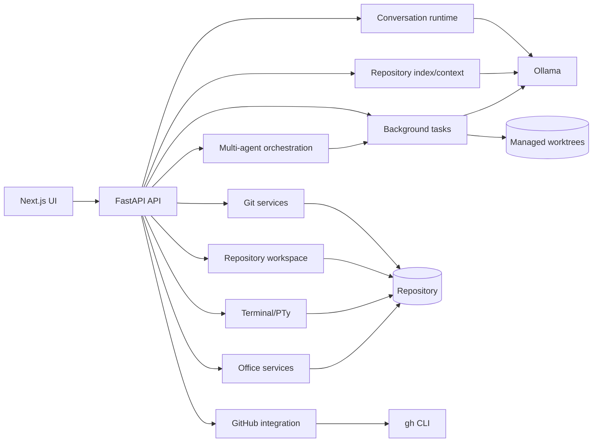

# Olladex Modules and Extensions

**Scope:** Olladex v0.8.1 `main` plus known expansion branches  
**Purpose:** explain capability ownership, dependencies, maturity and extension boundaries

---

## 1. Module map



---

## 2. Status legend

| Status | Meaning |
|---|---|
| **Core** | Present on `main` and part of v0.8.1. |
| **Core + optional dependency** | Present on `main`, but richer/full behaviour needs another installed tool/model. |
| **Expansion branch** | Implemented on a non-main feature branch. |
| **Planned** | Described direction, not complete current behaviour. |

---

## 3. Core modules

### 3.1 Conversation Runtime — Core

Primary responsibilities:

- persistent chats/sessions;
- model request construction;
- streamed agent turns;
- tool invocation tracking;
- inline user questions;
- steering;
- stop/cancellation state;
- saved checkpoints/context;
- tool-budget handling;
- interrupted-turn recovery semantics.

Primary implementation area:

```text
backend/app/services/conversation_runtime.py
backend/app/conversation_routes.py
frontend/components/Conversation.tsx
```

Related document:

- `docs/conversation-runtime.md`

### 3.2 Ollama Service — Core

Responsibilities:

- server connectivity;
- model discovery;
- chat requests;
- streamed output;
- embeddings;
- tool-loop integration;
- recoverable model/tool errors;
- repeated-call guards.

Primary implementation:

```text
backend/app/services/ollama.py
backend/app/services/runtime_settings.py
```

Runtime dependencies:

- reachable Ollama service;
- configured chat model;
- optional configured embedding model.

### 3.3 Repository Workspace — Core

Responsibilities:

- project path confinement;
- repository tree;
- file reads;
- manual file writes;
- search/index source collection;
- safe path resolution;
- file-history protection.

Primary implementation:

```text
backend/app/services/workspace.py
backend/app/services/changes.py
frontend/components/FileTree.tsx
```

Security boundary:

- path traversal outside the selected repository is rejected;
- symlink file handling is deliberately restricted in search/index flows.

### 3.4 Reviewable Changes — Core

Responsibilities:

- store agent edits as proposals;
- generate unified diffs;
- split proposals into hunks;
- selective hunk application;
- reject;
- conflict-safe revert;
- history backups.

Primary implementation:

```text
backend/app/services/changes.py
frontend/app/page.tsx
```

### 3.5 Terminal/PTy — Core

Responsibilities:

- repository-scoped local command execution;
- ANSI output;
- live input;
- resize;
- cancellation;
- command history/status persistence;
- terminal shortcut controls.

Primary implementation:

```text
backend/app/services/terminal.py
backend/app/services/terminal_jobs.py
backend/app/services/windows_pty.py
frontend/components/TerminalPanel.tsx
```

Platform behaviour:

- Linux/macOS: local PTY;
- Windows: ConPTY through `pywinpty` when available, with fallback behaviour.

### 3.6 Git Module — Core

Responsibilities:

- status;
- branches;
- checkout;
- stage/unstage;
- commit;
- history/diff;
- remote/upstream/ahead-behind state;
- exact-command proposals for fetch/pull/push.

Primary implementation:

```text
backend/app/services/git.py
frontend/components/GitControls.tsx
```

External dependency:

- Git executable and host credentials/configuration.

### 3.7 GitHub Module — Core + optional dependency

Responsibilities:

- detect `gh` availability/authentication;
- list issues;
- queue issue implementation;
- list/review PRs;
- fetch PR detail/diff/checks;
- comments;
- approve/request changes;
- exact-command PR creation proposal.

Primary implementation:

```text
backend/app/services/github.py
backend/app/github_review_routes.py
frontend/components/GitHubPanel.tsx
```

Dependency:

```text
GitHub CLI (gh), authenticated on the host
```

### 3.8 Background Task Queue — Core

Responsibilities:

- persistent queued tasks;
- task workers;
- recovery;
- status/result/error persistence;
- cancellation checks;
- worktree-aware execution;
- task-to-branch/PR lifecycle.

Primary implementation:

```text
backend/app/services/task_queue.py
frontend/components/BackgroundTasksPanel.tsx
```

Configuration:

```text
OLLADEX_TASK_WORKERS
```

### 3.9 Worktree Isolation — Core

Introduced as the main isolation model for v0.8 task execution.

Responsibilities:

- managed task worktrees;
- `olladex/task-<id>` task branches;
- route task filesystem operations into the task worktree;
- preserve the main checkout for normal UI operations;
- safe cleanup only when no uncommitted work remains.

This is a critical boundary for safe parallel execution.

### 3.10 Multi-agent Orchestration — Core

Responsibilities:

- lead task creation;
- autonomous decomposition;
- bounded specialist plan;
- parent/child task relationships;
- explicit dependencies;
- agent roles;
- dependency result hand-offs;
- final reviewer task;
- review bundles;
- integration preflight;
- managed integration worktrees/branches;
- overlap reporting;
- conflict-safe cherry-pick integration;
- combined verification;
- final integration PR.

Primary implementation:

```text
backend/app/services/orchestration.py
backend/app/orchestration_routes.py
frontend/components/TaskOrchestrationPanel.tsx
```

Integration branches:

```text
olladex/integration-<lead-task-id>
```

### 3.11 Repository Intelligence — Core

Responsibilities:

- language/file detection;
- framework detection;
- symbols;
- suggested test/build commands;
- parser metadata.

Primary implementation:

```text
backend/app/services/symbols.py
backend/app/services/repository_index.py
frontend/components/ProjectPanel.tsx
```

Dependency:

- `tree-sitter-language-pack` where supported;
- fallback parser where tree-sitter coverage is unavailable.

### 3.12 Repository Index and Context Engine — Core + optional dependency

Responsibilities:

- persistent incremental index;
- stale/deleted-file cleanup;
- lexical ranking;
- Ollama embeddings;
- cached vectors;
- hybrid retrieval;
- context budget selection;
- Context Lens preview.

Primary implementation:

```text
backend/app/services/repository_index.py
backend/app/services/context_engine.py
frontend/components/ProjectPanel.tsx
```

Optional dependency:

- embedding model such as `nomic-embed-text`.

Fallback:

- lexical ranking when embedding generation is unavailable.

### 3.13 Model Profiles — Core

Responsibilities:

- reusable profile CRUD;
- built-in profile protection;
- chat model;
- embedding model;
- temperature;
- maximum tool steps;
- context file count;
- context token budget;
- context character budget;
- project profile selection.

Primary implementation:

```text
backend/app/services/runtime_settings.py
frontend/components/ProjectPanel.tsx
```

### 3.14 Session Summary / Saved Context — Core

Responsibilities:

- compact deterministic session summaries;
- persistence into future model context;
- reduce dependence on replaying every historic token.

Primary implementation:

```text
backend/app/services/session_summary.py
```

### 3.15 Diagram Studio — Core

Responsibilities:

- Mermaid source editor;
- Graphviz/DOT source editor;
- live local SVG render;
- sanitised SVG display;
- SVG export.

Primary implementation:

```text
frontend/components/DiagramStudio.tsx
```

Dependencies:

- Mermaid;
- `@viz-js/viz`;
- DOMPurify.

### 3.16 Office Core — Core

Current `main` capability:

- inspect DOCX;
- inspect XLSX;
- inspect PPTX;
- inspect PDF;
- create basic DOCX;
- create basic XLSX;
- create basic PPTX.

Primary implementation:

```text
backend/app/services/office.py
frontend/components/OfficePanel.tsx
```

Dependencies:

- `python-docx`;
- `openpyxl`;
- `python-pptx`;
- `pypdf`.

Current PDF status:

- read-only inspection.

### 3.17 Electron Desktop Shell — Core

Responsibilities:

- desktop window/application lifecycle;
- isolated preload bridge;
- loopback sidecar startup;
- ephemeral token hand-off;
- packaging;
- release/update metadata;
- updater integration.

Primary implementation:

```text
desktop/main.cjs
desktop/preload.cjs
desktop/package.json
desktop/scripts/
```

Targets:

- AppImage;
- DEB;
- DMG;
- NSIS.

### 3.18 Desktop Updater — Core + optional credentials

Responsibilities:

- manual update check;
- optional automatic launch-time check;
- GitHub release metadata.

Optional environment:

```text
OLLADEX_GITHUB_TOKEN
OLLADEX_AUTO_UPDATE_CHECK=1
```

---

## 4. Expansion modules

### 4.1 Office Editors — Expansion branch

Relevant branches:

```text
feature/office-editors
feature/office-editors-main-ready
feature/office-convergence
```

These branches add richer structured Office editing that is deliberately separated from the current core Office module.

Main additions:

#### Word Studio

- page-like document canvas;
- paragraph selection;
- Title/Subtitle/Heading styles;
- bullets/numbering;
- alignment;
- run-level bold/italic/underline/font size/colour;
- paragraph insert/append/delete;
- tables;
- images;
- hyperlinks;
- headers/footers;
- section orientation and margins;
- richer DOCX inspection.

#### Spreadsheet Studio

- worksheet grid;
- sheet tabs;
- cell/formula bar;
- formatting;
- multi-cell writes;
- sheet add/rename/delete;
- insert/delete rows/columns;
- merge/unmerge;
- freeze panes;
- filters;
- dimensions;
- XLSX tables/ListObjects;
- rich workbook inspection.

#### Presentation Studio

- slide thumbnail rail;
- slide canvas;
- shape selection;
- text/geometry/style edits;
- add/delete/reorder slides;
- add textboxes/shapes/images;
- background colour;
- richer PPTX inspection.

Safety pattern:

- preview edits on temporary copies;
- apply validates a temporary copy first;
- timestamped binary backup in `.olladex/history`;
- atomic source replacement.

Status:

**Expansion branch — not current `main` behaviour.**

See [Office Expansion](OFFICE_EXPANSION.md).

### 4.2 Office Convergence Utilities — Expansion branch

The convergence work ports reusable Office engine ideas from Context Studio while keeping Olladex repository-centric.

Excel additions include:

- formula-aware fill;
- range formatting;
- sorting;
- bar/line/pie chart creation;
- formula validation;
- optional headless LibreOffice recalculation;
- CSV import/export;
- selected-range context;
- before/after comparison;
- XLSM-safe editing.

Word/PowerPoint additions include:

- before/after structured comparison;
- bounded selection context for LLM use.

Additional Office API kinds on the expansion branch:

```text
validate
recalculate
export_csv
import_csv
context
```

Status:

**Expansion branch — not current `main` behaviour.**

### 4.3 AI Office Document Agent — Planned integration phase

The Office expansion documentation identifies an AI document-agent phase intended to:

- operate on structured Office objects;
- produce reviewable object-level proposals;
- summarise document-specific changes;
- preserve safe rollback.

Status:

**Planned / next integration phase**, not complete core behaviour.

---

## 5. Extension boundaries

Olladex should remain repository-centred. Expansion work should avoid silently importing unrelated application concepts from other projects.

The Office convergence notes explicitly retain these Olladex boundaries:

- no Context Studio portfolio hierarchy;
- no Knowledge/rule inheritance layer;
- no Context Studio permissions model;
- no Context Studio ChangeSet database model;
- Office edits continue to follow Olladex preview/apply/history concepts.

Use this as a general rule for future extensions: port reusable engines and patterns, not unrelated domain architecture.

---

## 6. Adding a new backend capability

Recommended pattern:

1. identify service ownership;
2. create a dedicated service module under `backend/app/services`;
3. expose a bounded API route;
4. add Pydantic request/response schemas where appropriate;
5. keep repository path resolution in shared safe workspace utilities;
6. persist state through existing database/migration conventions;
7. add tests;
8. add frontend surface only after API behaviour is stable;
9. update the manual/modules/architecture documents.

Avoid placing all new logic in `main.py` simply because it is easy to reach.

---

## 7. Adding a new agent tool

A safe agent tool should:

- have a narrow purpose;
- validate project/task scope;
- return structured, recoverable errors;
- avoid ambiguous destructive defaults;
- participate in approval policy where side effects are meaningful;
- record tool intention/result in conversation activity;
- respect worktree routing for background tasks;
- have repeated-call protection where a model could loop.

If the tool writes files, prefer the same proposal/preview/history pattern used by existing modules.

---

## 8. Adding a new UI workspace

A new major workspace should justify a separate navigation surface.

Before adding one, ask:

- can it live inside Project/Changes/Queue instead?
- is it used often enough to deserve a persistent rail item?
- does it need its own selected-file routing?
- what is the narrow backend API it consumes?
- what is its safety/approval model?

Document the control names and workflow in the main manual before merge.

---

## 9. Adding an optional external integration

Follow the GitHub pattern:

1. detect availability;
2. detect authentication/configuration;
3. report a useful status in UI;
4. keep credentials in the external tool/host environment rather than duplicating them in Olladex;
5. degrade gracefully when unavailable;
6. make high-impact operations reviewable;
7. document installation separately from core setup.

---

## 10. Module dependency table

| Module | Core? | External dependency | Persistent state | Main risk boundary |
|---|---|---|---|---|
| Conversation runtime | Yes | Ollama | SQLite | tool/model execution |
| Workspace/files | Yes | filesystem | repository + SQLite metadata | path confinement |
| Changes | Yes | filesystem | SQLite + `.olladex/history` | file writes/revert |
| Terminal | Yes | OS shell/PTy | SQLite run state | OS command execution |
| Git | Yes | Git | repository | remote/branch writes |
| GitHub | Yes | `gh` | SQLite operation state | remote collaboration actions |
| Task queue | Yes | Ollama/Git | SQLite + worktrees | concurrent execution |
| Orchestration | Yes | task/Git/GitHub | SQLite + worktrees | dependency/integration correctness |
| Repository index | Yes | optional embedding model | SQLite | context relevance/data volume |
| Model profiles | Yes | installed Ollama models | SQLite | model/tool-budget configuration |
| Diagrams | Yes | browser JS libraries | source files as chosen | rendered SVG sanitisation |
| Office core | Yes | Python Office libs | repository + history | binary document writes |
| Desktop | Yes | Electron | OS app data | sidecar/process/update security |
| Rich Office editors | Expansion | Python Office libs, optional LibreOffice | repository + history | structured binary editing |

---

## 11. Release/documentation rule

When a module moves from expansion branch to `main`:

1. change its status in this document from **Expansion branch** to **Core**;
2. merge its operating procedure into the main manual;
3. update setup if new dependencies/environment variables are introduced;
4. update architecture/API notes;
5. remove wording that implies users must switch branches;
6. ensure release notes identify the first core version containing it.
