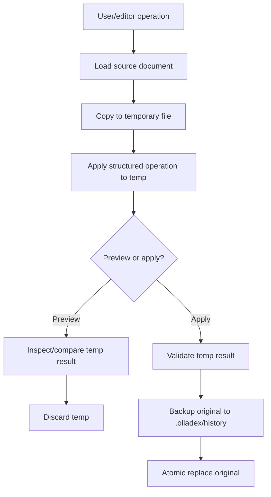
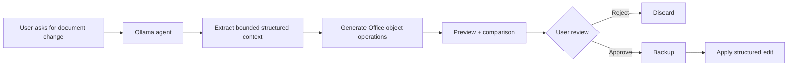

# Olladex Office Expansion

**Status:** expansion branch documentation  
**Applies to:** `feature/office-editors`, `feature/office-editors-main-ready`, `feature/office-convergence`  
**Core compatibility baseline:** Olladex v0.8.1 `main`

This document describes the richer Office editor work that exists outside the current `main` branch. It is intentionally separate from the main manual so users of v0.8.1 do not assume that branch-only editors are released core functionality.

---

## 1. Why this expansion exists

The Office module on `main` focuses on practical inspection and basic generation of DOCX/XLSX/PPTX plus PDF inspection.

The expansion line develops a much richer structured editing experience:

- **Word Studio**;
- **Spreadsheet Studio**;
- **Presentation Studio**;
- richer structured Office operations;
- preview/apply comparison;
- safer binary mutation workflow;
- selected-document context for AI use;
- spreadsheet utility functions learned from Context Studio.

The design goal is to extend Olladex without importing Context Studio's unrelated portfolio/governance/business-rule layers.

---

## 2. Branch status

### `feature/office-editors`

Original isolated rich-editor development line.

### `feature/office-editors-main-ready`

A compact integration-oriented Office editor branch containing the editor/services/tests/docs needed to bring the feature back toward `main`.

At the time this documentation was produced, comparison with `main` showed the branch had diverged and contained Office-specific additions including:

```text
backend/app/services/office_word.py
backend/app/services/office_excel.py
backend/app/services/office_excel_plus.py
backend/app/services/office_powerpoint.py
frontend/components/WordStudio.tsx
frontend/components/SpreadsheetStudio.tsx
frontend/components/PresentationStudio.tsx
frontend/components/OfficeEditor.tsx
.github/workflows/office-editors-ci.yml
```

### `feature/office-convergence`

Broader convergence line carrying the same rich editors plus reverse-ported utility ideas from Context Studio.

Because these branches have diverged from active `main`, integration should be done by carefully porting/rebasing the Office changes onto the current core runtime rather than assuming a blind branch merge will be clean.

---

## 3. Safety model

The expansion preserves the Olladex review-first philosophy for binary documents.



Key rules:

- preview does not mutate the source file;
- apply validates before replacement;
- applied binary changes create timestamped history backups;
- replacement is atomic where implemented;
- PDF remains read-only.

---

## 4. Word Studio

### Foundation capability

- page-like document canvas;
- selectable paragraphs;
- Title, Subtitle and Heading 1–3 styles;
- bullets and numbered-list styles;
- paragraph alignment;
- bold/italic/underline;
- font size and colour;
- append/insert/delete paragraph;
- table creation;
- row/column/cell editing support;
- image insertion;
- hyperlink insertion;
- header/footer editing;
- portrait/landscape section handling;
- margin-aware inspection;
- rich inspection of runs, tables, sections and inline-image dimensions.

### Example structured operations

```json
{"action":"set_paragraph","paragraph_index":1,"text":"Updated text","style":"Heading 2","alignment":"center"}
```

```json
{"action":"set_run","paragraph_index":1,"run_index":0,"bold":true,"font_size":14,"color":"1768E5"}
```

```json
{"action":"add_table","rows":3,"columns":2,"style":"Table Grid"}
```

```json
{"action":"add_image","paragraph_index":1,"image_path":"docs/image.png","width_inches":4}
```

```json
{"action":"set_section","section_index":0,"orientation":"landscape"}
```

### Remaining depth identified by branch documentation

- direct run selection in UI;
- richer table UI;
- advanced image positioning/wrapping/captions;
- page/section breaks;
- document-derived styles;
- comments/tracked changes where practical;
- AI Word-object proposals.

---

## 5. Spreadsheet Studio

### Foundation capability

- interactive worksheet grid;
- sticky row/column headers;
- worksheet tabs;
- cell address and formula/value bar;
- formula preservation/visibility;
- font size/bold/italic;
- font/fill colour;
- alignment/wrapping;
- number formats;
- multi-cell range writes;
- add/rename/delete worksheets;
- insert/delete rows and columns;
- merge/unmerge;
- freeze panes;
- AutoFilter;
- row heights;
- column widths;
- true XLSX ListObject/Table creation;
- rich inspection of formulas, formatting, merges, tables, panes and filters.

### Example structured operations

```json
{"action":"set_cell","sheet":"Data","cell":"B2","value":"=SUM(B3:B10)"}
```

```json
{"action":"set_cell_format","sheet":"Data","cell":"B2","bold":true,"fill_color":"FFF2CC","number_format":"0.00"}
```

```json
{"action":"set_range_values","sheet":"Data","start_cell":"C1","values":[["Status"],["Open"]]}
```

```json
{"action":"insert_rows","sheet":"Data","index":2,"amount":1}
```

```json
{"action":"merge_cells","sheet":"Data","range":"D1:E1"}
```

```json
{"action":"freeze_panes","sheet":"Data","cell":"A2"}
```

```json
{"action":"add_table","sheet":"Data","range":"A1:C20","name":"DataTable","style":"TableStyleMedium2"}
```

### Remaining depth identified by branch documentation

- virtualised navigation for very large sheets;
- direct range selection/fill/copy UX;
- borders;
- validation;
- conditional formatting;
- named ranges;
- charts;
- formula calculation/preview strategy.

The convergence work already implements several of these backend utility directions, described below.

---

## 6. Presentation Studio

### Foundation capability

- slide thumbnail rail;
- scaled slide canvas;
- selectable shapes;
- geometry inspection in inches;
- shape text editing;
- position/size/rotation;
- fill and line colour;
- text styling;
- add/delete/reorder slides;
- layout selection;
- add textboxes;
- add basic shapes;
- add project images;
- slide background colour;
- rich inspection of layouts, dimensions, shape geometry and text runs.

### Example structured operations

```json
{"action":"set_shape_text","slide_index":0,"shape_index":0,"text":"Updated title"}
```

```json
{"action":"set_shape_position","slide_index":0,"shape_index":0,"left":1,"top":0.5,"width":5,"height":1,"rotation":0}
```

```json
{"action":"set_shape_style","slide_index":0,"shape_index":0,"fill_color":"D9EAF7","font_color":"112233","font_size":24}
```

```json
{"action":"add_slide","title":"Next steps","content":"More detail","layout_index":1}
```

```json
{"action":"add_textbox","slide_index":0,"left":1,"top":2,"width":4,"height":1,"text":"New text"}
```

```json
{"action":"add_shape","slide_index":0,"shape":"rounded_rectangle","left":7,"top":3,"width":2.5,"height":1.2,"text":"Status"}
```

```json
{"action":"add_image","slide_index":0,"image_path":"docs/image.png","left":1,"top":1,"width":4}
```

### Remaining depth identified by branch documentation

- drag/resize handles;
- z-order/grouping;
- slide notes;
- charts;
- richer image handling;
- Mermaid/Graphviz asset insertion;
- theme/master awareness;
- slide-template workflows.

---

## 7. Office convergence utilities

The convergence branch reverse-ports reusable Office-engine ideas from Context Studio while retaining Olladex's repository architecture.

### Excel utility additions

- formula-aware range fill using `openpyxl.formula.translate.Translator`;
- multi-cell range formatting;
- sorting with optional header support;
- bar/line/pie chart creation;
- formula validation;
- broken/missing worksheet reference detection;
- optional headless LibreOffice recalculation;
- CSV export;
- project-file CSV import;
- before/after cell-level comparisons;
- selected-range extraction for LLM context;
- XLSM-safe editing using `keep_vba=True` in the unified spreadsheet editor.

### Additional spreadsheet operations

```text
set_cells
fill
format
sort
chart
```

These complement the existing cell/range/sheet/merge/pane/filter/dimension/table operations.

---

## 8. Additional Office API kinds

On the convergence branch, the existing Office POST endpoint supports additional `kind` values:

### `validate`

Validate workbook formulas/references.

### `recalculate`

Recalculate an XLSX workbook with LibreOffice when available, with backup before replacement.

### `export_csv`

Export a chosen worksheet to CSV.

### `import_csv`

Import a project CSV into a worksheet at a selected start cell.

### `context`

Extract a bounded Word/Excel/PowerPoint selection for model context.

### `preview` / `edit`

Responses include structured before/after comparison data on the expansion branch.

---

## 9. Optional LibreOffice dependency

LibreOffice is only needed for the optional workbook recalculation path.

The rest of the rich Office editing stack continues to use Python document libraries.

If LibreOffice is absent:

- editing can still operate;
- formulas can still be stored/translated/validated;
- headless external recalculation is unavailable.

The UI/service should report this as an optional capability, not a fatal Office failure.

---

## 10. PDF status

PDF remains read-only throughout the described Office expansion work.

Do not imply editable PDF support unless a future branch introduces and verifies it.

---

## 11. AI document-agent direction

The Office branch identifies a later AI integration phase.

Target behaviour:



Principles:

- operate on structured document objects rather than regenerating whole files;
- produce reviewable change summaries;
- use preview before apply;
- retain `.olladex/history` rollback;
- avoid coupling Office work to unrelated core-agent runtime changes until integration is deliberate.

Status: **planned integration phase**.

---

## 12. Recommended integration plan to current `main`

Because `main` has advanced to v0.8.1 with worktrees, PR review and multi-agent orchestration, integrate Office in controlled stages rather than merging an old branch wholesale.

### Stage 1 — backend service port

Port/update:

```text
backend/app/services/office_word.py
backend/app/services/office_excel.py
backend/app/services/office_excel_plus.py
backend/app/services/office_powerpoint.py
```

Reconcile with current:

```text
backend/app/services/office.py
backend/app/schemas.py
current API assembly/routes
```

### Stage 2 — tests

Port/update:

```text
backend/tests/test_office_word.py
backend/tests/test_office_excel.py
backend/tests/test_office_powerpoint.py
backend/tests/test_office.py
```

Run the full current backend suite, not only Office tests.

### Stage 3 — frontend studios

Port/update:

```text
frontend/components/OfficeEditor.tsx
frontend/components/WordStudio.tsx
frontend/components/SpreadsheetStudio.tsx
frontend/components/PresentationStudio.tsx
frontend/components/OfficePanel.tsx
```

Reconcile with the current right-pane scrolling/layout behaviour and current v0.8.1 UI conventions.

### Stage 4 — AI/tool integration

Only after direct structured editing is stable:

- expose bounded selection context to the conversation runtime;
- add explicit structured Office tool schemas;
- route background-task Office writes into task worktrees correctly;
- ensure binary history backup location is worktree-aware;
- make previews/reviews visible before apply.

### Stage 5 — documentation/release

When merged:

- move rich editor operating procedures into the main manual;
- change module status to Core;
- add any new dependency to setup;
- update release notes;
- ensure version visible in frontend/backend/desktop packages is incremented consistently.

---

## 13. Integration test matrix

Before merging rich Office support to `main`, verify at least:

| Area | Required check |
|---|---|
| DOCX | inspect, preview, apply, backup, reopen |
| DOCX tables/images | create/edit and reopen in Word-compatible application |
| XLSX | values, formulas, formatting, sheets, merges, tables |
| XLSX formula fill | translated references correct |
| XLSX validation | broken refs detected |
| XLSX CSV | import/export correct |
| XLSM | macros preserved during supported edits |
| PPTX | text, geometry, shapes, slides, images |
| Preview | source file unchanged |
| Apply | timestamped backup created |
| Failure | original source survives invalid operation |
| Worktrees | task edits remain in task worktree, not main checkout |
| Frontend | production build and TypeScript check |
| Full backend | all current v0.8.1 tests pass |

---

## 14. User-facing status wording

Until merged to `main`, describe these features as:

> Rich Office editors are available on the Office expansion branches for evaluation. The released/core v0.8.1 Office module supports structured inspection and basic Office-file generation; PDF is read-only.

Do not describe Word Studio, Spreadsheet Studio or Presentation Studio as current `main` capability until the integration PR is merged and released.
