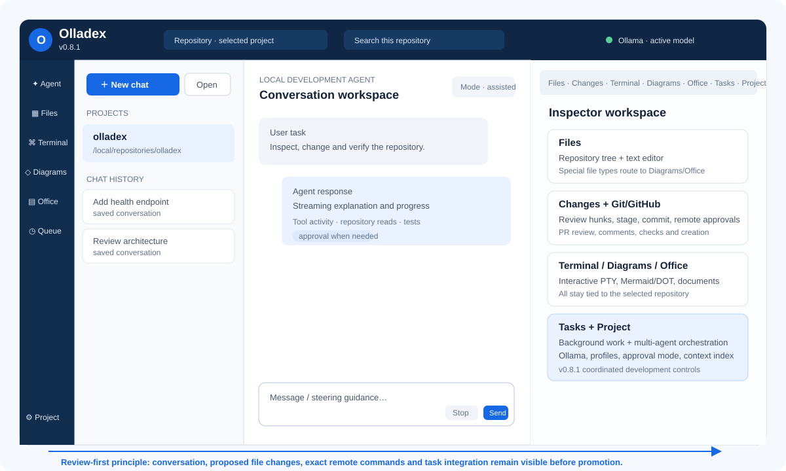
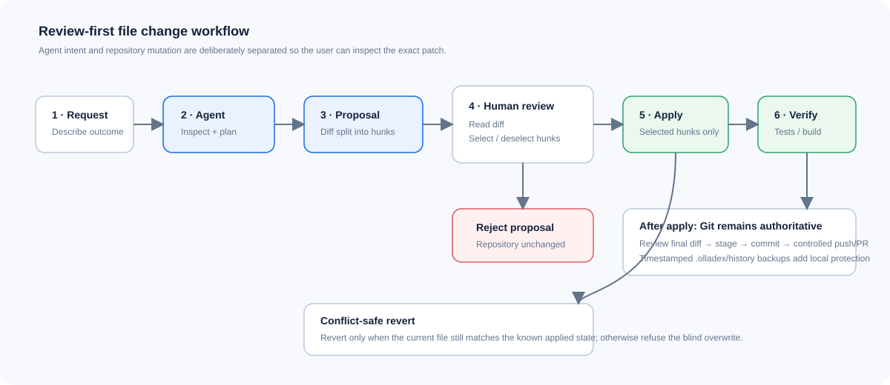
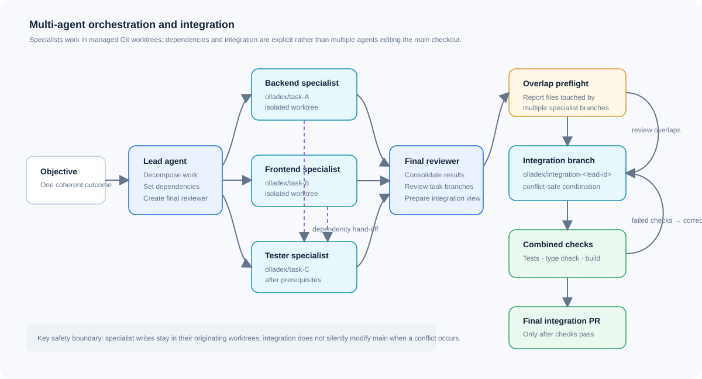
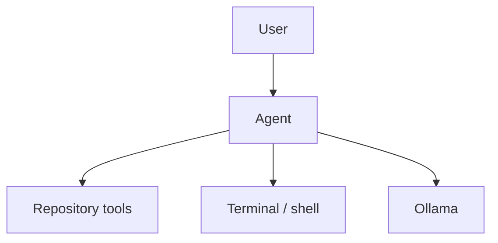
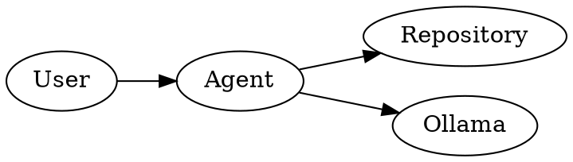

# Olladex Manual

**Application:** Olladex  
**Document scope:** v0.8.1 `main`  
**Audience:** developers, technical users, administrators and reviewers  
**Purpose:** primary operating manual for the application

> Olladex is a local-first, repository-centred AI development workspace powered by Ollama. It combines an AI coding conversation with repository browsing, reviewable file changes, a local terminal, controlled Git/GitHub workflows, diagrams, Office-file tools and persistent parallel/multi-agent tasks.

---

## 1. What Olladex is

Olladex is designed to let a local language model work on a real software repository while keeping important actions visible and reviewable.

The normal operating loop is:

1. open a local repository;
2. create or reopen a chat;
3. describe the development outcome;
4. let the agent inspect repository context and use permitted tools;
5. review proposed file changes and commands;
6. run tests or builds;
7. review Git changes;
8. stage and commit accepted work;
9. optionally push and create/review a GitHub pull request.

For larger work, the same repository can use persistent background tasks and v0.8.1 multi-agent orchestration. Those tasks use managed Git worktrees so specialists can work in isolation rather than competing in the main checkout.



---

## 2. Core design principles

### 2.1 Local first

Repository files, the Ollama model connection, the shell and the SQLite application database are local to the machine running Olladex unless you deliberately point Ollama at another trusted host or use a remote Git/GitHub operation.

### 2.2 Repository first

A project in Olladex represents a local repository path. File, search, context, terminal and Git operations are scoped to that selected project.

### 2.3 Review before destructive change

Agent edits are normally proposed first. Remote Git operations and GitHub PR creation are prepared as exact commands and require explicit approval. Arbitrary shell behaviour is controlled by the selected approval mode.

### 2.4 Persistent work

Chats, task activity, checkpoints, model profiles, repository index information and background task state are stored so work can survive UI reloads and process restarts.

### 2.5 Isolation for parallel agents

Background specialists can run in managed worktrees and task branches. The normal repository checkout remains separate from the task workspaces.

---

## 3. Main interface

The Olladex screen is arranged as a persistent development workspace.

### 3.1 Top bar

The top bar shows:

- Olladex and the running backend version;
- the selected repository;
- repository search access;
- Ollama/model connection state;
- desktop update status when running inside Electron.

### 3.2 Left navigation rail

The navigation rail provides the principal work areas:

| Area | Purpose |
|---|---|
| **Agent** | Main conversational development workspace. |
| **Files** | Repository tree, file inspection and manual editing. |
| **Terminal** | Interactive repository-scoped local terminal. |
| **Diagrams** | Mermaid and Graphviz/DOT editor and SVG preview/export. |
| **Office** | Inspect Office/PDF files and create basic DOCX/XLSX/PPTX files. |
| **Queue** | Persistent background tasks and multi-agent orchestration. |
| **Project** | Ollama, project, model profile, approval, Git identity, context and repository intelligence settings. |

### 3.3 Project and chat sidebar

The sidebar next to the navigation rail contains:

- **New chat**;
- **Open** repository;
- project list;
- saved **Chat history**.

Chats are project-specific. Starting a new chat does not delete an older conversation.

### 3.4 Conversation panel

The centre panel is the main agent conversation. It displays user/assistant messages and tool activity. During an active turn, Olladex can stream responses, ask inline questions, show approvals and expose tool outcomes.

### 3.5 Inspector panel

The right-hand inspector has tabs for:

- Files;
- Changes;
- Terminal;
- Diagrams;
- Office;
- Tasks;
- Project.

The **Changes** tab shows a badge when agent file proposals are awaiting a decision.

---

## 4. First start

For the full installation procedure, see [Setup and Configuration](SETUP_AND_CONFIGURATION.md).

Typical source start:

```bash
cp .env.example .env
chmod +x start-local.sh
./start-local.sh
```

The script:

1. creates `.venv` when required;
2. installs Python dependencies;
3. installs frontend Node dependencies;
4. creates the local data directory;
5. creates an API connection token when one is not supplied;
6. starts FastAPI on loopback;
7. starts the Next.js frontend on loopback.

Paste the displayed connection token into the browser when prompted.

Default local addresses are:

- application: `http://localhost:5081`
- FastAPI: `http://localhost:8001`
- API base used by the frontend: `http://localhost:8001/api`

### 4.1 First-run checks

Before opening a repository, confirm:

- the top bar reports Ollama connected;
- the intended chat model is installed;
- the embedding model is installed if semantic repository ranking is required;
- Git is available;
- `gh` is authenticated if GitHub issue/PR workflows will be used.

---

## 5. Opening a repository

1. Select **Open**.
2. Enter the absolute local path of the repository.
3. Submit the form.
4. Olladex creates or reuses a project record for that repository path.
5. The repository appears in the Projects list.

After the project loads, Olladex refreshes:

- repository tree;
- chat sessions;
- pending changes;
- Git status;
- repository intelligence;
- repository index state.

### 5.1 Recommended first prompt

A good first prompt is:

```text
Inspect this repository, explain its architecture, identify the normal test/build commands, and tell me which files are most relevant to the main application flow. Do not change anything yet.
```

This gives the model a low-risk opportunity to build useful repository context before modification begins.

---

## 6. Chat and agent execution

### 6.1 Starting a chat

Select **New chat**. A new persistent session is created for the selected repository.

### 6.2 Writing effective tasks

Give the agent:

- the outcome you want;
- constraints that must not change;
- relevant file/module names when known;
- required verification;
- whether it may edit or should inspect only.

Example:

```text
Add a health endpoint to the API without changing existing routes. Update tests and run the relevant backend test suite. Show me the proposed changes before they are applied.
```

### 6.3 Steering an active turn

Olladex supports continued guidance while work is running. Use steering to correct scope or add a constraint instead of cancelling and restarting unless the original direction is unsafe or fundamentally wrong.

### 6.4 Stop

Use **Stop** to request cancellation. Cancellation is cooperative: the current model request or tool operation may need to reach a cancellation point before the turn finishes stopping.

### 6.5 Interrupted work and saved context

If a process restarts during a turn, Olladex marks the turn interrupted rather than pretending it completed. When continuing from saved context, the agent should inspect uncertain outcomes before acting on them.

### 6.6 Tool budget

Model profiles can define a maximum number of tool steps. If the budget is exhausted, treat the turn as incomplete unless the requested outcome was demonstrably finished before the limit.

---

## 7. Approval modes

Approval mode is set per project in **Project → Project rules**.

### Review

Use when you want maximum supervision. Arbitrary agent shell commands require approval.

Best for:

- unfamiliar repositories;
- destructive migrations;
- deployment scripts;
- security-sensitive work;
- new local models whose tool behaviour is not yet trusted.

### Assisted

Allows common read-only/test/build operations while holding higher-impact shell behaviour for review.

Best general-purpose mode.

### Autonomous

Allows the agent to run with much less command friction.

Use only on a trusted local machine and a repository where the consequences of shell commands are understood. The shell is not an operating-system sandbox.

---

## 8. File browsing and manual editing

### 8.1 Repository tree

The Files view displays the selected repository. Use **Filter files** to narrow the tree.

Olladex rejects repository path traversal and skips symlink files for repository indexing/search safety.

### 8.2 Opening a text file

Select a text/code file to load it into the editor.

If the draft differs from the saved file, the UI marks it **Modified**.

### 8.3 Saving a manual edit

Select **Save**.

Manual writes are project-scoped and maintain file-history protection. The write is also represented in change state so it can be reviewed alongside other work.

### 8.4 Special file routing

Selecting these file types automatically opens the relevant inspector:

- `.mmd`, `.mermaid` → Diagrams;
- `.dot` → Diagrams;
- `.docx`, `.xlsx`, `.pptx`, `.pdf` → Office.

---

## 9. Review-first agent file changes

Agent changes are stored as proposals rather than immediately overwriting repository files.



### 9.1 Review a proposal

Open **Changes** and inspect:

- path;
- unified diff;
- proposed hunks;
- proposal state.

### 9.2 Partial application

Each proposal is divided into hunks. Deselect any hunk that should not be applied, then apply the selected hunks.

This allows useful parts of an agent edit to be accepted without taking an entire patch.

### 9.3 Reject

Reject a proposal when none of it should be written.

### 9.4 Revert

Applied changes can be reverted only when the current file still matches the expected applied state. This conflict-safe behaviour prevents a revert from silently destroying later work.

### 9.5 History backups

Olladex keeps timestamped previous versions beneath `.olladex/history` for protected file-writing workflows.

---

## 10. Terminal

The Terminal view provides an ANSI-capable xterm surface backed by a local PTY.

### 10.1 Run a command

Enter a command and select **Run**.

Commands start in the selected repository context.

### 10.2 Interactive programs

While a process is active, the terminal accepts keyboard input. UI shortcuts include:

- Ctrl-C;
- Tab;
- Up;
- Down;
- Escape;
- Stop.

### 10.3 Clear

**Clear** clears the displayed terminal surface. It does not erase persisted run history from the application database.

### 10.4 Security rule

A command entered manually in the terminal is treated as an explicit user instruction. It runs with the operating-system rights of the Olladex process.

Never expose Olladex to untrusted users who can reach the terminal.

---

## 11. Git workflow

Git controls are shown in the Changes area for Git repositories.

### 11.1 Branches

Use the branch selector to switch an existing branch.

Use **Create & switch** to create a new branch and check it out.

Recommended pattern:

```text
feature/<short-description>
fix/<short-description>
docs/<short-description>
```

### 11.2 Stage and unstage

Each changed file shows Stage/Unstage controls.

Review the diff before staging.

### 11.3 Commit

1. stage the intended files;
2. enter a commit message;
3. select **Commit staged**.

The Git author name/email come from the project settings.

### 11.4 Remote Git operations

Fetch, pull and push use a two-step process:

1. **Prepare fetch/pull/push**;
2. review the exact command, remote and remote URL;
3. **Approve & run** or **Reject**.

Pull is designed as a controlled fast-forward workflow rather than an implicit conflict-producing merge.

---

## 12. GitHub workflow

The GitHub panel depends on the local GitHub CLI (`gh`) and an authenticated repository remote.

### 12.1 Open issues

Open issues can be listed in the panel. Select **Queue implementation** to turn an issue into a persistent Olladex task.

### 12.2 Pull request review

The PR workspace can display:

- open PRs;
- head/base branches;
- review decision;
- check status;
- PR body;
- diff;
- mergeability when available.

You can:

- add a conversation comment;
- approve a PR;
- request changes with a review note.

### 12.3 Creating a PR

1. ensure the current branch contains the intended committed work;
2. open **Prepare pull request**;
3. enter base branch, title and description;
4. select **Prepare exact command**;
5. inspect the generated `gh pr create` command;
6. select **Approve & create PR** or reject it.

This preserves the same exact-command approval model used by remote Git operations.

---

## 13. Background tasks

Background tasks allow work to continue as a persistent queue item instead of tying the whole task to one foreground chat turn.

Use them for:

- longer test/build work;
- issue implementation;
- independent repository changes;
- work that should survive UI navigation;
- parallel specialist work.

Task state is stored in SQLite. Olladex can recover persisted task state after restart and can mark interrupted work correctly.

### 13.1 Worktree isolation

From v0.8, managed task execution uses Git worktrees and task branches such as:

```text
olladex/task-<task-id>
```

Agent file operations for that task are routed to its worktree. Normal UI repository operations continue to use the main checkout.

### 13.2 Task promotion

Completed task branches can be committed, pushed and promoted into a pull-request workflow.

### 13.3 Cleanup

Olladex only removes managed task worktrees when it is safe to do so. Automatic cleanup refuses a worktree that still contains uncommitted changes.

---

## 14. Multi-agent orchestration

v0.8.1 adds coordinated lead/specialist/reviewer workflows.



### 14.1 Start an autonomous lead

Open **Queue / Tasks** and use **Multi-agent orchestration**.

Provide:

- optional plan title;
- number of specialists (2–10);
- objective.

Select **Start autonomous lead**.

The lead asks Ollama to break the objective into bounded specialist tasks and a final reviewer/consolidation task.

### 14.2 Generated task graph

Tasks record:

- parent/child relationships;
- agent role;
- dependencies;
- status;
- worktree branch;
- PR number/state when promoted.

A dependent task waits for prerequisites. Failed or cancelled prerequisites can block downstream work.

### 14.3 Manual specialist

Use **Advanced → add a specialist manually** when you need exact control over:

- title;
- role;
- parent task;
- dependency IDs;
- prompt.

Supported UI roles include worker, frontend, backend, researcher, reviewer and tester.

### 14.4 Review bundle

Use **Review** on a plan to inspect child results, task branch information, diffs and errors before integration.

### 14.5 Integration workflow

For a lead task:

1. select **Integrate**;
2. select completed specialist tasks;
3. select **Check overlaps**;
4. review any files changed by multiple branches;
5. select **Build integration branch**;
6. inspect the combined diff;
7. run the combined check command;
8. only after checks pass, push the integration branch;
9. create the final integration PR.

The default combined validation command shown by the v0.8.1 UI is:

```bash
python -m pytest backend/tests -q && cd frontend && npx tsc --noEmit && npm run build
```

Adjust it for repositories that use different verification commands.

### 14.6 Integration branch

Managed integration work uses a branch such as:

```text
olladex/integration-<lead-task-id>
```

Conflict-safe cherry-pick integration aborts instead of modifying `main` when a conflict cannot be safely applied.

---

## 15. Project settings

Open **Project** for project and AI configuration.

### 15.1 Repository intelligence

The Project panel shows:

- file count;
- indexed bytes;
- detected symbols;
- languages;
- frameworks;
- suggested tests/build commands.

Tree-sitter is used where supported, with a portable fallback parser.

### 15.2 Project instructions

Project instructions are automatically included in agent context.

Good project instructions contain stable rules such as:

```text
- Do not edit generated migration files manually.
- Run backend pytest and frontend TypeScript checks before declaring a task complete.
- Preserve the existing API response format.
```

Avoid putting one-off task details into persistent project instructions.

### 15.3 Git identity

Configure project-specific Git author name and email if the defaults are not appropriate.

---

## 16. Ollama connection

The Project panel contains **Ollama server & defaults**.

Configure:

- server URL;
- default chat model;
- embedding model.

Use **Test server + models** before saving.

Use **Validate & save** to persist valid settings and update the built-in local model profiles.

### 16.1 Local and network Ollama

Examples:

```text
http://127.0.0.1:11434
http://192.168.1.249:11434
```

When using a network-hosted Ollama server, keep it on a trusted network and ensure the host permits the Olladex machine to connect.

---

## 17. Model profiles

Reusable model profiles control how the agent works.

Profile fields include:

- profile name;
- chat model;
- embedding model;
- temperature;
- maximum tool steps;
- context file count;
- model context token budget;
- context character budget.

Built-in profiles are protected. Custom profiles can be created, updated and deleted.

### 17.1 Profile guidance

For coding work, prefer a low temperature unless deliberate creative variation is useful.

Increase tool steps for complex tasks only when the selected model can reliably plan and recover from tool errors.

Keep the context-token setting within the actual context capability of the selected Ollama model.

---

## 18. Repository index and Context Lens

Olladex maintains a persistent incremental repository index.

Context selection can use:

- lexical ranking;
- Ollama embeddings;
- hybrid ranking;
- cached vectors.

If the configured embedding model is unavailable, Olladex falls back to lexical ranking.

### 18.1 Refresh repository index

Use the Project panel index refresh after major external repository changes if the normal incremental refresh has not yet caught up.

### 18.2 Context preview

The Context Lens can rank repository content for a query and show which files/excerpts would be selected.

Use it when a model appears to be reading irrelevant files or missing an important module.

Example query:

```text
Where is authentication and API token validation implemented?
```

---

## 19. Conversation memory

Olladex stores compact session summaries and saved preferences/decisions for local continuity.

Use saved preferences for durable working rules, not transient task instructions.

Examples of appropriate saved decisions:

- preferred test command;
- repository coding convention;
- stable architecture constraint.

Examples of inappropriate saved decisions:

- one temporary branch name;
- a one-off debug hypothesis;
- a secret or credential.

---

## 20. Diagrams

The Diagrams workspace supports Mermaid and Graphviz/DOT.

### 20.1 Mermaid

Select **Mermaid**, enter diagram source and allow the preview to render.

Example:



### 20.2 Graphviz/DOT

Select **Graphviz / DOT**.

Example:



### 20.3 Export

Select **Export SVG** after the preview renders successfully.

Mermaid and DOT are rendered locally in the browser.

---

## 21. Office files on `main`

The v0.8.1 core Office module is deliberately practical and lightweight.

### 21.1 Inspect

Selecting a DOCX, XLSX, PPTX or PDF routes the file to Office inspection. The preview displays a structured representation returned by the backend.

### 21.2 Create Word

Choose Word, set path/title/content and create the DOCX.

### 21.3 Create Excel

Choose Excel. Enter comma-separated rows in the content box. Olladex converts them into worksheet data.

### 21.4 Create PowerPoint

Choose PowerPoint, set path/title/content and create the PPTX.

### 21.5 PDF

PDF is inspection/read-only.

### 21.6 Rich Office expansion

A separate expansion line adds Word Studio, Spreadsheet Studio and Presentation Studio with structured editing. It is not part of v0.8.1 `main`; see [Office Expansion](OFFICE_EXPANSION.md).

---

## 22. Desktop application

Olladex includes an Electron desktop shell.

Development start:

```bash
./start-desktop.sh
```

Current-platform installer build:

```bash
npm --prefix desktop install
npm --prefix desktop run dist
```

Supported packaging targets configured in the repository are:

- Linux AppImage;
- Linux DEB;
- macOS DMG;
- Windows NSIS.

The desktop app starts its frontend/API sidecars on loopback and passes an ephemeral connection token through the Electron preload bridge.

### 22.1 Updates

Packaged builds support update checks through GitHub release metadata.

For a private release source, the desktop process can use `OLLADEX_GITHUB_TOKEN`. Olladex does not persist that token in its database.

Automatic update checks can be enabled with:

```bash
OLLADEX_AUTO_UPDATE_CHECK=1
```

---

## 23. Data and backups

Default data root:

```text
./data
```

Default SQLite database:

```text
./data/olladex.sqlite3
```

Repository write history:

```text
<repository>/.olladex/history/
```

Managed task worktrees are controlled by Olladex and should not be manually deleted while tasks are active.

### 23.1 Backup recommendation

Back up both:

1. the repository through normal Git/remotes;
2. the Olladex data root if conversation/task history is important.

Do not treat `.olladex/history` as a substitute for Git.

---

## 24. Security boundary

Olladex provides application-level controls, not a hostile-code sandbox.

Important rules:

- repository file tools resolve paths against the selected project;
- file path escape attempts are rejected;
- agent edits are reviewable proposals;
- remote Git and PR creation use explicit command approval;
- the shell runs with the permissions of the Olladex OS process;
- Autonomous mode increases trust placed in the model;
- manually entered terminal commands are considered explicit user instructions;
- a network-hosted Ollama server should be trusted;
- Olladex should not be directly exposed to the public Internet.

For higher-risk repositories, run Olladex under a dedicated low-privilege OS account or inside a controlled development VM/container environment with only the required repository mounted.

---

## 25. Recommended operating workflow

For routine development:

1. update the local repository manually or through approved Git fetch/pull;
2. create a feature/fix branch;
3. open a new chat;
4. ask for inspection before modification on unfamiliar work;
5. ask for the change plus required verification;
6. review shell approvals;
7. review proposed file hunks;
8. apply accepted hunks;
9. run tests/build;
10. review Git diff;
11. stage selected files;
12. commit;
13. prepare and approve push;
14. prepare and approve PR creation;
15. review checks and PR status.

For larger work, substitute steps 3–8 with the multi-agent orchestration workflow and integrate only completed/validated specialist branches.

---

## 26. Prompt patterns

### Architecture review

```text
Inspect the repository and explain the architecture. Identify entry points, major modules, data stores, external dependencies and normal test/build commands. Do not change files.
```

### Safe bug fix

```text
Find the cause of <problem>. Explain the evidence first. Then make the smallest safe fix, add or update regression tests, and run the relevant checks. Do not make unrelated refactors.
```

### Refactor

```text
Refactor <module> to <goal> while preserving public behaviour. Identify affected callers first. Make the change in reviewable steps and run the existing tests plus any new tests needed to protect behaviour.
```

### Multi-agent objective

```text
Implement <feature> across backend, frontend and tests. Preserve existing API compatibility. Split the work so independent specialists can proceed in parallel, then run a final integration review and full checks.
```

### Repository research

```text
Find every place where <concept> is implemented or configured. Group results by runtime path, UI, tests and configuration. Do not edit anything.
```

---

## 27. Quick-reference decision table

| Need | Best Olladex surface |
|---|---|
| Ask the model to inspect/change code | Agent chat |
| Browse/edit a text file directly | Files |
| Accept part of an AI patch | Changes → hunk selection |
| Run an interactive command | Terminal |
| Stage/commit | Changes → Git controls |
| Fetch/pull/push | Git remote proposal + approval |
| Implement GitHub issue | GitHub → Queue implementation |
| Review PR | GitHub PR review |
| Long-running independent work | Queue/background task |
| Large coordinated feature | Multi-agent orchestration |
| Inspect model/retrieval settings | Project |
| Test Ollama endpoint/model | Project → Ollama server & defaults |
| See repository ranking | Project → Context Lens |
| Create architecture/process diagram | Diagrams |
| Inspect/create simple Office file | Office |
| Rich Word/Excel/PowerPoint editing | Office expansion branch |

---

## 28. Known boundaries in v0.8.1

- Core Office creation/editing is not a full Word/Excel/PowerPoint replacement.
- PDF is read-only.
- Semantic retrieval depends on an available embedding model; lexical fallback remains available.
- GitHub workflows depend on a working/authenticated `gh` CLI.
- Shell execution is not sandboxed from the operating system.
- Cancellation is cooperative.
- Desktop signing/notarisation requires external signing credentials.
- Rich Office editor work exists on expansion branches and must not be documented as current `main` behaviour.

---

## 29. Related documents

- [Setup and Configuration](SETUP_AND_CONFIGURATION.md)
- [Workflows](WORKFLOWS.md)
- [Modules and Extensions](MODULES_AND_EXTENSIONS.md)
- [Office Expansion](OFFICE_EXPANSION.md)
- [Architecture and Developer Reference](ARCHITECTURE_AND_DEVELOPER_REFERENCE.md)
- [Troubleshooting](TROUBLESHOOTING.md)
- [Conversation runtime notes](conversation-runtime.md)

---

## 30. Documentation ownership

This manual is intended to evolve with Olladex. Any change that alters a visible control, approval rule, task lifecycle, configuration variable, persistent storage behaviour or security boundary should update this manual in the same development cycle.
