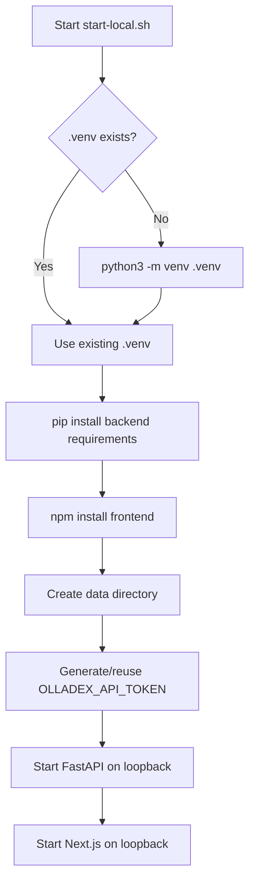

# Olladex Setup and Configuration

**Scope:** Olladex v0.8.1 `main`  
**Audience:** installers, administrators, developers and desktop packagers

This document is the authoritative reference for source installation, runtime environment variables, startup scripts, desktop packaging and local deployment.

---

## 1. Supported operating model

Olladex is intended to run on a trusted local workstation or trusted LAN host.

The application is composed of:

- Next.js/React frontend;
- FastAPI backend;
- SQLite data store;
- Ollama chat/embedding service;
- local filesystem/Git/shell access;
- optional GitHub CLI integration;
- optional Electron desktop shell.

The source startup scripts bind the application services to loopback by default. Network access requires deliberate configuration.

---

## 2. Prerequisites

### Required

- Python 3.11 or newer;
- Node.js 22 or newer;
- npm;
- Git;
- Ollama reachable from the Olladex host.

### Strongly recommended

- `nomic-embed-text` or another configured embedding model for hybrid repository retrieval;
- GitHub CLI (`gh`) when using issue/PR features.

### Desktop build dependencies

- the requirements above;
- Electron/electron-builder dependencies installed through npm;
- platform-specific build tooling required by electron-builder;
- signing/notarisation credentials only when signed artifacts are required.

---

## 3. Repository layout relevant to setup

```text
olladex/
├── .env.example
├── start-local.sh
├── start-desktop.sh
├── backend/
│   ├── requirements.txt
│   └── app/
├── frontend/
│   ├── package.json
│   └── next.config.ts
├── desktop/
│   ├── package.json
│   ├── main.cjs
│   ├── preload.cjs
│   └── scripts/
├── .github/workflows/
└── data/                  # created locally; runtime data root by default
```

---

## 4. Quick source installation

```bash
git clone <repository-url>
cd olladex
cp .env.example .env
chmod +x start-local.sh
./start-local.sh
```

The script installs/updates required Python and frontend packages each time it starts.

It then prints a connection token. Paste that token into the browser when Olladex asks for authentication.

---

## 5. `start-local.sh`

The source launcher performs the following sequence:



Current script behaviour:

- project root is the directory containing `start-local.sh`;
- `.venv` is created if absent;
- `backend/requirements.txt` is installed;
- npm cache defaults to `/tmp/olladex-npm-cache` unless `OLLADEX_NPM_CACHE` is set;
- `data/` is created;
- API token is generated when one is not already exported;
- backend default port: `8001`;
- frontend default port: `5081`;
- both services bind to `127.0.0.1` in the current script.

### Override ports

```bash
OLLADEX_API_PORT=8010 OLLADEX_PORT=5090 ./start-local.sh
```

### Override npm cache

```bash
OLLADEX_NPM_CACHE="$HOME/.cache/olladex-npm" ./start-local.sh
```

---

## 6. Manual development start

Use this when you want separate terminals, debugger attachment or direct control over the services.

### Python environment

```bash
python3 -m venv .venv
.venv/bin/pip install -r backend/requirements.txt
```

### Frontend dependencies

```bash
npm --prefix frontend install
```

### Generate a connection token

```bash
export OLLADEX_API_TOKEN="$(.venv/bin/python -c 'import secrets; print(secrets.token_urlsafe(32))')"
printf 'Connection token: %s\n' "$OLLADEX_API_TOKEN"
```

The backend configuration requires at least 24 characters for the token.

### Start backend

```bash
OLLADEX_DATA_ROOT="$PWD/data" \
  .venv/bin/uvicorn backend.app.api:app \
  --reload \
  --host 127.0.0.1 \
  --port 8001
```

### Start frontend

In another terminal:

```bash
NEXT_PUBLIC_API_URL=http://localhost:8001/api \
  npm --prefix frontend run dev -- --hostname 127.0.0.1 --port 5081
```

---

## 7. Environment reference

The backend uses the `OLLADEX_` prefix. `.env` is read automatically by the Pydantic settings layer.

### `OLLADEX_OLLAMA_URL`

Default in backend code:

```text
http://127.0.0.1:11434
```

Example repository `.env.example` value:

```text
http://192.168.1.249:11434
```

Use the address of the Ollama service visible from the machine running Olladex.

### `OLLADEX_OLLAMA_MODEL`

Default chat model used when another project/profile selection does not override it.

Current example:

```text
qwen3:14b
```

### `OLLADEX_OLLAMA_EMBEDDING_MODEL`

Default:

```text
nomic-embed-text
```

Install with:

```bash
ollama pull nomic-embed-text
```

If the embedding model is missing or unreachable, Olladex falls back to lexical repository ranking.

### `OLLADEX_DATA_ROOT`

Default:

```text
./data
```

Contains the SQLite database and application-owned persistent data.

### `OLLADEX_CORS_ORIGINS`

Comma-separated browser origins permitted by the API CORS layer.

Example:

```text
http://localhost:5081,http://127.0.0.1:5081
```

CORS is not a substitute for the API bearer token.

### `OLLADEX_COMMAND_TIMEOUT_SECONDS`

Default:

```text
120
```

Base command timeout used by controlled command execution.

Long-running interactive terminal sessions have their own lifecycle and can continue until completion/cancellation as supported by the terminal service.

### `OLLADEX_MAX_FILE_BYTES`

Default:

```text
2000000
```

Maximum size used by file-oriented application workflows that enforce this setting.

### `OLLADEX_TASK_WORKERS`

Default:

```text
3
```

Number of background task workers. v0.8 task worktrees allow these workers to operate in isolation when tasks are managed through the task runtime.

Choose a value appropriate to:

- CPU/GPU capacity;
- Ollama concurrency behaviour;
- repository size;
- memory availability.

More workers do not guarantee higher throughput if the local model can only process one request efficiently.

### `OLLADEX_API_TOKEN`

Bearer token used by the browser/frontend to authenticate to the backend.

- minimum length: 24 characters;
- `start-local.sh` generates one if absent;
- Electron provides an ephemeral token through the preload bridge;
- for manual backend startup you must export one yourself.

Do not commit this token to Git.

### `OLLADEX_CONTEXT_TOKENS`

Default:

```text
16384
```

Backend-wide default context-token budget.

Allowed backend range:

```text
8192 .. 262144
```

The effective project/model-profile setting can further control context sizing.

### `NEXT_PUBLIC_API_URL`

Frontend API base URL.

Default source value:

```text
http://localhost:8001/api
```

Because this is a Next.js public environment value, treat it as application routing information, not a secret.

### `OLLADEX_NPM_CACHE`

Startup-script convenience variable controlling the npm cache path.

Default:

```text
/tmp/olladex-npm-cache
```

### `OLLADEX_API_PORT`

Startup-script override for the backend port.

Default:

```text
8001
```

### `OLLADEX_PORT`

Startup-script override for the frontend port.

Default:

```text
5081
```

### `OLLADEX_GITHUB_TOKEN`

Optional desktop release-update authentication token when the update source requires authentication.

The application does not store this token in its SQLite database.

### `OLLADEX_AUTO_UPDATE_CHECK`

Set to `1` to request an automatic desktop update check after launch.

---

## 8. Example `.env`

```dotenv
OLLADEX_OLLAMA_URL=http://127.0.0.1:11434
OLLADEX_OLLAMA_MODEL=qwen3:14b
OLLADEX_OLLAMA_EMBEDDING_MODEL=nomic-embed-text
OLLADEX_DATA_ROOT=./data
OLLADEX_CORS_ORIGINS=http://localhost:5081,http://127.0.0.1:5081
OLLADEX_COMMAND_TIMEOUT_SECONDS=120
OLLADEX_MAX_FILE_BYTES=2000000
OLLADEX_TASK_WORKERS=3
OLLADEX_CONTEXT_TOKENS=16384
NEXT_PUBLIC_API_URL=http://localhost:8001/api
```

Keep the API token outside the file when practical, particularly on shared machines.

---

## 9. Network-hosted Ollama

Olladex can use an Ollama server on another trusted machine.

Example:

```dotenv
OLLADEX_OLLAMA_URL=http://192.168.1.249:11434
```

Checklist:

1. confirm the remote Ollama instance is listening on an address reachable from Olladex;
2. confirm host firewall rules permit the connection;
3. install the required chat/embedding models on the Ollama host;
4. open **Project → Ollama server & defaults**;
5. select **Test server + models**;
6. save only after the requested models are reported available.

Avoid exposing an unauthenticated Ollama service to the public Internet.

---

## 10. LAN access to the Olladex UI

The current `start-local.sh` binds backend and frontend to `127.0.0.1`, so LAN use requires deliberate changes or a trusted reverse proxy/tunnel.

When changing bind addresses:

- update backend host binding;
- update frontend host binding;
- set `NEXT_PUBLIC_API_URL` to a URL reachable by client devices;
- add the browser origin to `OLLADEX_CORS_ORIGINS`;
- preserve bearer-token authentication;
- protect the host firewall;
- do not publish the shell-enabled service directly to the Internet.

Example conceptual LAN configuration:

```text
Frontend: http://192.168.1.50:5081
Backend:  http://192.168.1.50:8001/api
```

Then the frontend value would be:

```dotenv
NEXT_PUBLIC_API_URL=http://192.168.1.50:8001/api
```

and CORS must include the frontend origin.

---

## 11. Python dependencies

`backend/requirements.txt` currently includes:

| Package | Purpose |
|---|---|
| FastAPI | HTTP API |
| Uvicorn | ASGI server |
| httpx | Ollama/HTTP interactions |
| pydantic-settings | environment/configuration |
| python-multipart | multipart request support |
| python-docx | Word inspection/generation |
| openpyxl | Excel inspection/generation |
| python-pptx | PowerPoint inspection/generation |
| pypdf | PDF inspection |
| pytest | backend tests |
| tree-sitter-language-pack | repository symbol/language intelligence |
| pywinpty | Windows ConPTY support |

Do not remove an apparently optional package without checking the relevant module and automated tests.

---

## 12. Frontend dependencies

The v0.8.1 frontend is based on:

- Next.js 16;
- React 19;
- Mermaid 11;
- Viz.js for Graphviz/DOT;
- xterm 6 and fit addon;
- DOMPurify for rendered SVG sanitisation;
- Playwright for end-to-end testing;
- TypeScript.

Useful commands:

```bash
npm --prefix frontend run dev
npm --prefix frontend run build
npm --prefix frontend run lint
npm --prefix frontend run test:e2e
```

The `lint` script currently runs strict TypeScript checking with `tsc --noEmit`.

---

## 13. Backend verification

Run:

```bash
.venv/bin/python -m pytest -q
```

For the v0.8.1 repository, the release notes record backend pytest, frontend TypeScript checking and a production Next.js build as release verification gates.

---

## 14. Recommended full verification

```bash
.venv/bin/python -m pytest -q
npm --prefix frontend run lint
npm --prefix frontend run build
```

For desktop changes also run the relevant desktop packaging/syntax checks.

---

## 15. `start-desktop.sh`

The desktop development launcher:

1. creates `.venv` when required;
2. installs backend Python dependencies;
3. installs frontend dependencies;
4. installs desktop dependencies;
5. runs the desktop `start` npm script.

Command:

```bash
./start-desktop.sh
```

Desktop npm start expands to:

```text
npm run prepare:app && electron .
```

---

## 16. Desktop packaging

Install dependencies:

```bash
npm --prefix desktop install
```

Build for the current operating system:

```bash
npm --prefix desktop run dist
```

The build process:

1. builds/freezes the API sidecar;
2. prepares the production frontend;
3. runs electron-builder.

Configured targets:

| Platform | Target |
|---|---|
| Linux | AppImage, DEB |
| macOS | DMG |
| Windows | NSIS |

Artifact naming pattern:

```text
Olladex-<version>-<os>-<arch>.<ext>
```

### Portable Linux build

```bash
npm --prefix desktop run portable:linux
```

---

## 17. Desktop signing and notarisation

Unsigned artifacts are valid for internal testing but may trigger OS warnings.

The repository supports optional signing through environment/repository secrets.

Electron signing variables documented by the project include:

```text
CSC_LINK
CSC_KEY_PASSWORD
```

Apple notarisation additionally requires:

```text
APPLE_ID
APPLE_APP_SPECIFIC_PASSWORD
APPLE_TEAM_ID
```

Keep signing material out of repository files and local application data.

---

## 18. GitHub release workflow

Tags matching `v*` trigger the desktop release workflow configured in:

```text
.github/workflows/release-desktop.yml
```

The release pipeline builds platform artifacts and attaches them to a GitHub release.

The desktop package currently publishes against:

```text
zageabb/olladex
```

and identifies the repository as public in v0.8.1 metadata.

---

## 19. CI workflow

General CI is configured under:

```text
.github/workflows/ci.yml
```

v0.8.1 release notes describe combined validation covering:

- backend pytest;
- frontend strict TypeScript checking;
- production Next.js build;
- desktop dependency/syntax/release metadata checks.

Multi-agent integration should use a repository-appropriate combined check command before the integration branch is pushed.

---

## 20. Data directory

Default database path is derived as:

```text
<OLLADEX_DATA_ROOT>/olladex.sqlite3
```

With the default source configuration:

```text
./data/olladex.sqlite3
```

The database contains application state including projects, sessions, task state, model profiles, repository index metadata and other persistent workflow records.

### Backup

Stop Olladex before making a simple filesystem copy of the SQLite data directory if a consistent point-in-time backup is required.

Git repository contents should be backed up through Git/remotes independently.

---

## 21. Repository-local Olladex data

Protected file-edit workflows maintain history under:

```text
<project>/.olladex/history/
```

Background task worktrees are also Olladex-managed repository-related resources. Do not delete them manually while tasks are active.

---

## 22. GitHub CLI setup

Install `gh` using the normal package manager for the host OS.

Authenticate:

```bash
gh auth login
```

Verify:

```bash
gh auth status
```

The selected repository also needs a supported GitHub remote.

Olladex does not need to store GitHub credentials itself; it uses the credentials already configured for the local `gh`/Git environment.

---

## 23. Git identity

Olladex supports per-project Git author name/email settings.

Set them in **Project → Project rules** when the repository should not use the default Olladex identity.

Remote credentials remain owned by the normal Git credential mechanism on the host.

---

## 24. Windows terminal support

On Windows, Olladex prefers native ConPTY using `pywinpty` and retains a compatible pipe fallback when ConPTY is unavailable.

Command-shell fallback can use Git Bash, PowerShell or Command Prompt depending on the environment.

If terminal interaction differs between a source Linux/macOS installation and Windows desktop build, first verify:

- `pywinpty` installed correctly;
- shell executable availability;
- terminal process permissions;
- packaged API contains the required runtime dependency.

---

## 25. macOS considerations

For source use:

- ensure the active Node version is 22+;
- ensure Python resolves to 3.11+;
- allow terminal/development tooling access to repositories as required by macOS privacy controls.

For distributed DMGs, signing/notarisation removes many Gatekeeper warnings.

---

## 26. Linux considerations

The source launcher assumes a POSIX shell and uses standard virtualenv/npm commands.

The portable Linux desktop target is available separately from AppImage/DEB packaging.

When Ollama is on another Linux server, verify the Ollama listener/firewall rather than disabling Olladex authentication.

---

## 27. Reverse proxy guidance

A reverse proxy can be used on a trusted internal network, but remember that Olladex exposes a development terminal and repository operations.

Minimum controls:

- TLS where traffic leaves the local host;
- network ACL/firewall restriction;
- bearer token preserved end-to-end;
- CORS origin limited to the intended frontend;
- no public anonymous access;
- no proxy rule that strips the Authorization header.

---

## 28. Configuration precedence

Use the following mental model:

```text
Backend defaults
    ↓
.env / OLLADEX_* environment
    ↓
persisted runtime Ollama settings
    ↓
project settings
    ↓
selected model profile
```

Not every setting participates in every layer. For example, filesystem/data-root settings are backend process configuration, while model/profile fields can be changed through the application UI.

---

## 29. Production-like internal deployment checklist

Before treating an Olladex host as a shared internal service:

- [ ] dedicated host or VM considered;
- [ ] OS account has only required permissions;
- [ ] repository locations intentionally mounted/accessible;
- [ ] UI/API not exposed publicly;
- [ ] API bearer token active;
- [ ] CORS restricted;
- [ ] host firewall configured;
- [ ] Ollama connection trusted;
- [ ] Git/GitHub credentials scoped appropriately;
- [ ] data directory backed up where required;
- [ ] task-worker count sized to model hardware;
- [ ] update/signing policy documented;
- [ ] Autonomous mode policy agreed for shared use.

---

## 30. Files that must be reviewed when setup changes

When modifying installation/runtime behaviour, review these files together:

```text
.env.example
start-local.sh
start-desktop.sh
backend/app/config.py
backend/requirements.txt
frontend/package.json
frontend/next.config.ts
desktop/package.json
.github/workflows/ci.yml
.github/workflows/release-desktop.yml
README.md
docs/SETUP_AND_CONFIGURATION.md
```

A setup change is incomplete until documentation, sample configuration and automated verification agree.
