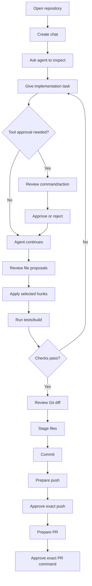
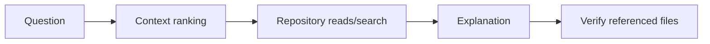
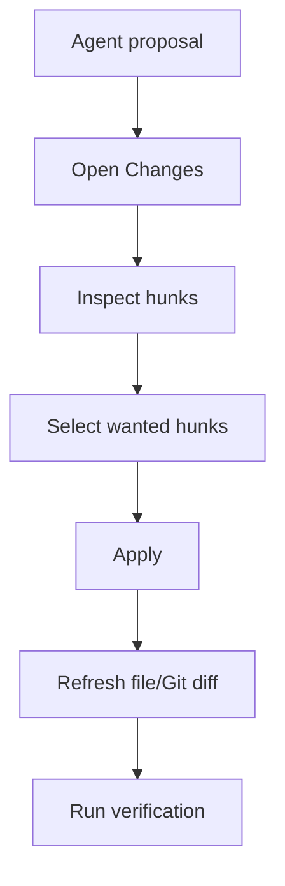
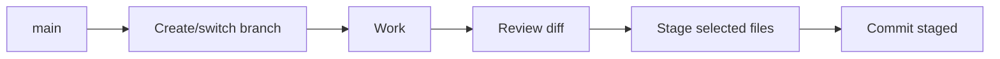
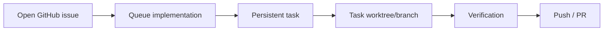
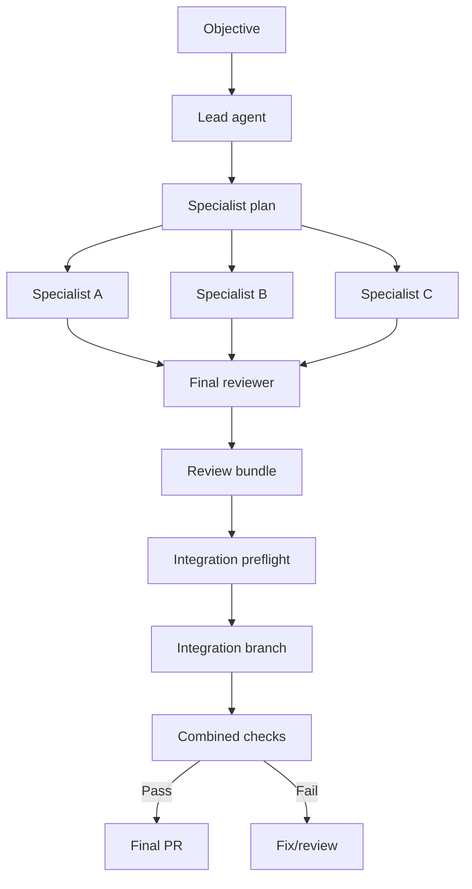

# Olladex Workflows

**Scope:** Olladex v0.8.1 `main`  
**Purpose:** repeatable operating procedures for common development tasks

These workflows are written as procedures that can be followed directly or adapted into team working instructions.

---

## 1. Standard single-agent development workflow



### Procedure

1. Open the intended repository.
2. Switch/create the working Git branch.
3. Create a new chat.
4. Ask the agent to inspect the affected area before making changes if the code is unfamiliar.
5. State the implementation objective and acceptance criteria.
6. Review any shell approval request.
7. Let the agent finish its proposal and verification attempt.
8. Open **Changes**.
9. Inspect each diff/hunk.
10. Deselect unwanted hunks.
11. Apply accepted hunks.
12. Run or re-run the required tests/build.
13. Review Git status and diff.
14. Stage the exact files intended for the commit.
15. Commit.
16. Prepare and approve push.
17. Prepare and approve PR creation.
18. Review CI/checks in the GitHub panel.

### Completion criteria

A task should not be considered complete merely because the agent says it is complete. Confirm:

- intended behaviour changed;
- no unintended file changes remain;
- tests/build were actually run and passed;
- Git diff is understood;
- branch/commit state is correct.

---

## 2. Investigation-only workflow

Use when you want explanation without repository changes.



### Prompt pattern

```text
Investigate <topic>. Read the repository and explain the current behaviour, relevant files, call/data flow and likely failure points. Do not edit files or run destructive commands.
```

### Review points

- confirm the response names real files/symbols;
- use Context Lens when the model appears to have selected irrelevant files;
- ask for evidence before accepting a root-cause conclusion.

---

## 3. Review-first bug fix

### Procedure

1. Reproduce or collect the observed error.
2. Ask the agent for likely cause and evidence before edits.
3. Ask it to identify the smallest safe fix.
4. Require a regression test where practical.
5. Review proposed patch hunks.
6. Apply the minimum required patch.
7. Run the regression test.
8. Run the affected suite/build.
9. Review for unrelated refactoring.
10. Commit only the bug fix and test.

### Prompt

```text
Find the root cause of <error>. Explain the evidence before changing anything. Then make the smallest safe fix, add/update a regression test, and run the relevant verification. Avoid unrelated refactoring.
```

---

## 4. Partial patch acceptance

Use when an agent proposal contains both wanted and unwanted edits.



### Rules

- select hunks by behaviour, not merely by file;
- if two hunks are logically dependent, accept/reject them together;
- re-open the resulting file after partial apply to make sure it still compiles/parses;
- tests are required after partial application because the exact final patch differs from the model's full proposal.

---

## 5. Safe revert workflow

1. Open the applied change entry.
2. Confirm no later manual/agent change has modified the same file unexpectedly.
3. Use **Revert**.
4. If Olladex refuses because the file no longer matches the expected applied state, do not force it.
5. Use Git diff/history or `.olladex/history` to reconstruct the intended state manually.

The conflict check exists to prevent a revert from destroying newer work.

---

## 6. Manual file editing workflow

1. Open **Files**.
2. Filter/select the file.
3. Edit the text in the editor.
4. Confirm the **Modified** indicator.
5. Select **Save**.
6. Refresh/review Changes and Git diff.
7. Run any relevant syntax/test/build checks.

Use the terminal or an external specialist editor for binary files and formats that the built-in editor does not support.

---

## 7. Interactive terminal workflow

1. Open **Terminal**.
2. Enter the command.
3. Select **Run**.
4. Interact with the running process through keyboard input.
5. Use Ctrl-C or **Stop** if required.
6. Read the final status/exit code.

### Good uses

- tests;
- build commands;
- development servers;
- REPLs;
- Git diagnostic commands;
- package-manager commands you explicitly want to run.

### Avoid

Do not paste commands you do not understand. Terminal input is treated as an explicit user action and runs with the Olladex process permissions.

---

## 8. Branch and commit workflow



### Procedure

1. Open the Git controls.
2. Confirm current branch.
3. Create/switch to the required working branch.
4. Complete and verify the change.
5. Stage files one by one.
6. Review staged state.
7. Enter a clear commit message.
8. Commit staged files.

Do not use the commit button as a substitute for reviewing the diff.

---

## 9. Controlled fetch workflow

1. Select the intended remote.
2. Select **Prepare fetch**.
3. Read the exact generated command and remote URL.
4. Select **Approve & run** or **Reject**.
5. Refresh Git state and inspect ahead/behind counts.

---

## 10. Controlled pull workflow

1. Ensure local work is committed or intentionally preserved.
2. Check current branch/upstream.
3. Select **Prepare pull**.
4. Review the exact command.
5. Approve only if the source/upstream are correct.
6. Confirm result.
7. Re-run relevant verification if upstream changes affect your work.

The controlled workflow is intended to avoid surprise merges.

---

## 11. Controlled push workflow

1. Confirm committed work and branch.
2. Confirm remote.
3. Confirm ahead/behind state.
4. Select **Prepare push**.
5. Review the exact command and destination.
6. Select **Approve & run**.
7. Confirm the branch is available remotely before preparing a PR.

---

## 12. GitHub issue-to-task workflow



### Procedure

1. Ensure `gh auth status` succeeds on the host.
2. Open the GitHub panel.
3. Expand **Open issues**.
4. Review the issue title/body/labels on GitHub if scope is unclear.
5. Select **Queue implementation**.
6. Monitor the queued task.
7. Review task results/diff.
8. Promote completed work through branch/PR workflow.

---

## 13. Prepare a pull request

1. Push the working branch if required.
2. Open GitHub → **Prepare pull request**.
3. Confirm head branch.
4. Set base branch.
5. Enter title.
6. Enter description covering summary/testing/review notes.
7. Select **Prepare exact command**.
8. Read the command shown in the approval card.
9. Reject if head/base/title are incorrect.
10. Select **Approve & create PR** when correct.

---

## 14. Pull-request review workflow

1. Open GitHub → Pull requests.
2. Select **Review**.
3. Read head/base branches and mergeability.
4. Review status checks.
5. Read PR description.
6. Read the complete diff.
7. Add a conversation comment when clarification is needed.
8. Use **Request changes** with a clear review note when issues must be fixed.
9. Use **Approve** only after the diff/checks satisfy review criteria.

---

## 15. Queue a persistent background task

Use Queue when the task should continue independently of the current foreground conversation.

### Good candidates

- issue implementation;
- time-consuming test/build loops;
- repository research that produces a durable result;
- independent changes that can use an isolated branch/worktree.

### Procedure

1. write a self-contained prompt;
2. include verification requirements;
3. queue the task;
4. monitor status;
5. review final result/error;
6. inspect its branch/worktree change set before promotion.

---

## 16. Multi-agent autonomous lead workflow



### Procedure

1. open Queue → Multi-agent orchestration;
2. enter optional title;
3. choose maximum specialists;
4. describe one coherent objective;
5. select **Start autonomous lead**;
6. review generated specialist plan;
7. monitor dependencies/statuses;
8. wait for specialists/reviewer to complete;
9. open Review before integration;
10. inspect task results and branch changes;
11. open Integrate.

---

## 17. Manual specialist workflow

Use when automatic decomposition does not represent the dependency graph you want.

1. expand **Advanced · add a specialist manually**;
2. choose role;
3. optionally assign parent;
4. add dependency task IDs;
5. write the specialist prompt;
6. queue specialist;
7. monitor downstream dependency state.

Dependency IDs must refer to valid tasks in the same project.

---

## 18. Multi-agent integration preflight

1. open **Integrate** for the lead task;
2. select completed specialist tasks with worktree branches;
3. select **Check overlaps**;
4. inspect any file appearing in multiple specialist branches;
5. decide whether the branches are compatible before building the integration branch.

An overlap is not automatically a conflict, but it is a high-value review point.

---

## 19. Build and validate integration branch

1. select specialists to integrate;
2. select **Build integration branch**;
3. review combined diff;
4. set the combined check command to match the repository;
5. select **Run checks**;
6. inspect complete output;
7. if checks fail, fix/rebuild/re-run;
8. only when status is passed, push the integration branch;
9. create final PR.

### Default Olladex repository check

```bash
python -m pytest backend/tests -q && cd frontend && npx tsc --noEmit && npm run build
```

For another repository, replace this with its actual authoritative verification.

---

## 20. Repository index refresh workflow

Use after a large external change, branch switch or generated-code update when repository context appears stale.

1. open Project;
2. inspect index status;
3. select repository index refresh;
4. wait for changed/removed/embedded counts to update;
5. use Context Lens with a representative query;
6. confirm relevant files are ranked.

---

## 21. Context Lens troubleshooting workflow

If the agent misses the right code:

1. open Project → Context Lens;
2. enter a specific question containing the actual domain words/symbols;
3. inspect selected file paths and excerpts;
4. if ranking is lexical-only, verify embedding model availability;
5. refresh repository index;
6. adjust project/model profile context-file/token budgets only if needed;
7. retry the agent task.

---

## 22. Change Ollama server/model

1. open Project → Ollama server & defaults;
2. enter server URL;
3. select/enter default chat model;
4. select/enter embedding model;
5. select **Test server + models**;
6. read connectivity/model availability result;
7. select **Validate & save**;
8. check effective project model/profile after save.

Do not save an endpoint you have not tested if the current configuration is still working.

---

## 23. Create a model profile

1. open Project → Project rules;
2. expand reusable profile editor;
3. choose **New profile** if another profile is selected;
4. set name;
5. choose chat model;
6. choose embedding model;
7. set temperature;
8. set maximum tool steps;
9. set context file count;
10. set context token/character budgets;
11. create profile;
12. select it for the project;
13. save project settings.

---

## 24. Mermaid diagram workflow

1. open Diagrams;
2. select Mermaid;
3. write/paste source;
4. wait for live render;
5. correct syntax if a Diagram error card appears;
6. select **Export SVG** when required.

Repository `.mmd`/`.mermaid` files can be selected from the tree to open their source in Diagram Studio.

---

## 25. Graphviz/DOT workflow

1. open/select a `.dot` file or choose Graphviz/DOT;
2. write source;
3. check rendered SVG;
4. fix parser errors shown in the preview;
5. export SVG.

---

## 26. Basic Word creation workflow

1. open Office;
2. choose Word;
3. set repository-relative file path ending `.docx`;
4. enter title;
5. enter content;
6. select create;
7. refresh tree;
8. select the created file to inspect it.

---

## 27. Basic Excel creation workflow

1. open Office;
2. choose Excel;
3. set `.xlsx` path;
4. enter title;
5. enter comma-separated rows, one row per line;
6. create;
7. inspect created workbook.

Example input:

```text
Item,Qty,Price
Cable,3,12.50
Connector,10,1.20
```

---

## 28. Basic PowerPoint creation workflow

1. open Office;
2. choose PowerPoint;
3. set `.pptx` path;
4. enter title/content;
5. create;
6. inspect result.

For richer slide editing, see the Office expansion documentation.

---

## 29. Desktop development workflow

```bash
./start-desktop.sh
```

Then:

1. confirm Electron window opens;
2. confirm backend version/connection;
3. open a test repository;
4. verify terminal and file workflows;
5. test desktop-specific update behaviour if changed.

---

## 30. Desktop release workflow

1. update application versions consistently;
2. run backend tests;
3. run frontend type/build checks;
4. run desktop syntax/package metadata checks;
5. build installer on target OS where possible;
6. test installed application;
7. create/tag release following repository policy;
8. let release workflow build/attach artifacts;
9. validate updater metadata.

---

## 31. Recovery after interrupted foreground turn

1. reopen the chat;
2. inspect the last tool/activity entries;
3. determine whether a command/file write may have partially completed;
4. use **Continue from saved context** only with an instruction to verify uncertain state;
5. check Git/file/terminal state before repeating an operation.

Recommended prompt:

```text
Continue from the saved context, but first inspect the repository and tool state to determine which previous actions actually completed. Do not repeat uncertain writes or commands until verified.
```

---

## 32. Recovery after failed background task

1. open the task result/error;
2. inspect its worktree/branch if still present;
3. check whether it produced useful partial changes;
4. review dependency impact on downstream tasks;
5. fix the cause in a new task or manual workflow;
6. do not manually remove managed worktrees containing uncommitted changes.

---

## 33. Workflow selection guide

| Situation | Workflow |
|---|---|
| Small change | Standard single-agent |
| Unknown bug | Review-first bug fix |
| Need explanation only | Investigation-only |
| Agent patch partly useful | Partial patch acceptance |
| Independent long task | Background queue |
| Large cross-module change | Multi-agent autonomous lead |
| Exact dependency graph required | Manual specialists |
| Branch ready for collaboration | Controlled push + PR |
| Reviewing someone else's work | GitHub PR review |
| Agent missing relevant files | Context Lens troubleshooting |
| AI model/server change | Ollama server/model workflow |
